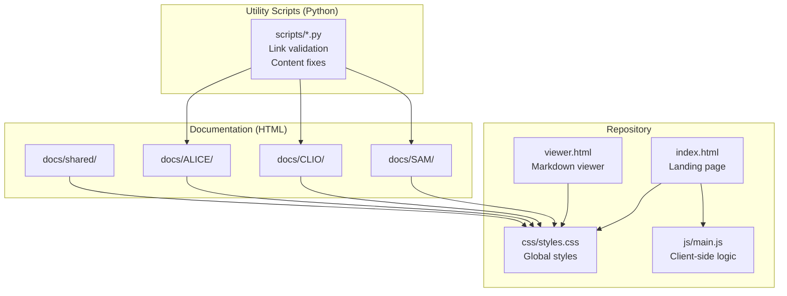

# AGENTS.md

**Version:** 1.0
**Date:** 2026-07-08
**Purpose:** Technical reference for SAM-website development

---

## Project Overview

The official documentation website for the Synthetic Autonomic Mind ecosystem (SAM, CLIO, ALICE).

- **Type:** Static documentation site (HTML/CSS/JS, no build step)
- **Stack:** HTML5, CSS3, vanilla JavaScript, Markdown-flavored HTML
- **Languages:** HTML, CSS, JavaScript, Python (utility scripts), Markdown
- **Architecture:** Client-side rendering, no backend, deployed via push-to-main
- **Live at:** https://www.syntheticautonomicmind.org
- **Visibility:** Public
- **License:** CC-BY-NC-4.0 (website content; SAM application is GPL-3.0)
- **Sibling projects:** `../SAM/`, `../CLIO/`, `../ALICE/` (used as source-of-truth for feature documentation)

---

## Quick Setup

```bash
# Clone
git clone git@github.com:SyntheticAutonomicMind/website.git
cd website

# Start local web server
python3 -m http.server 8000

# Open in browser
open http://localhost:8000
```

No package install, no build step. Edit HTML, refresh browser.

---

## Architecture



**Key facts:**
- No build pipeline. Files are deployed as-is.
- The site uses **HTML files directly** for documentation, not a markdown + viewer pipeline (despite what older README sections describe).
- External libraries via CDN: Marked.js (markdown rendering), Mermaid.js (diagrams), DOMPurify (sanitization).
- Auto-deploy: push to `main` -> live in 2-3 minutes.

---

## Directory Structure

| Path | Purpose |
|------|---------|
| `index.html` | Landing page with feature showcase |
| `viewer.html` | Markdown viewer (client-side rendering) |
| `*.html` (root) | Per-product landing pages (`clio-terminal-ai.html`, `local-ai-assistant-macos.html`, `stable-diffusion-macos.html`, `ai-coding-assistant-macos.html`) |
| `css/` | Stylesheets (`styles.css`) |
| `js/` | Client-side scripts (`main.js`) |
| `images/` | All image assets (PNG, JPG) |
| `docs/` | All documentation pages |
| `docs/SAM/` | SAM docs (end-user, power-user, developer subdirs) |
| `docs/CLIO/` | CLIO docs (flat structure) |
| `docs/ALICE/` | ALICE docs (flat structure) |
| `docs/shared/` | Cross-cutting topics (the-unbroken-method, contributing, the-reflexive-ecosystem) |
| `docs/link-validation.md` | Notes on link validation |
| `scripts/` | Python utilities for link/content fixes |
| `scratch/` | Working documents (gitignored) |
| `ai-assisted/` | Session handoff files (gitignored) |
| `project-docs/` | Long-running session plans (gitignored) |
| `.clio/` | CLIO internals (gitignored except `instructions.md`) |
| `.doc-template.html` | HTML template for new doc pages |
| `LICENSE` | CC-BY-NC-4.0 |
| `robots.txt`, `sitemap.xml`, `CNAME` | SEO + domain config |

---

## Code Style

### HTML Conventions

- **Semantic markup:** Use `<header>`, `<nav>`, `<main>`, `<article>`, `<section>`, `<footer>`. Avoid `<div>` soup.
- **Accessibility:** Every page has `<html lang="en">`, descriptive `<title>`, meta description. Images have alt text.
- **External links:** Always `rel="noopener noreferrer"` and `target="_blank"`.
- **Internal links:** Use relative paths (`./SAM/getting-started.html` not absolute URLs).
- **Templates:** Use `.doc-template.html` as the starting point for new doc pages.

### CSS Conventions

- **Single stylesheet:** `css/styles.css` holds global styles.
- **Class naming:** BEM-lite (`block__element--modifier`) or descriptive hyphenated classes.
- **Mobile-first:** Styles start narrow and expand.
- **Dark theme:** Optimized for readability. Light mode is secondary.

### JavaScript Conventions

- **Vanilla JS:** No frameworks or build tools.
- **Single entry:** `js/main.js` is the main script.
- **Libraries via CDN:** Marked.js for markdown, Mermaid.js for diagrams, DOMPurify for sanitization.
- **No globals:** Wrap in IIFEs or modules.

### Markdown Conventions (in HTML)

- Headings start at `<h1>` for the page title.
- Code blocks: `<pre><code class="language-XXX">`.
- Tables: standard HTML `<table>` with `<thead>` and `<tbody>`.
- Blockquotes for callouts: `<blockquote>` with a class for type (info, warning, success).

### Python Script Conventions

- **Shebang:** `#!/usr/bin/env python3`
- **Docstrings:** Module + function docstrings.
- **CLI args:** Use `argparse` for scripts that take parameters.
- **Stdlib only:** No pip dependencies.

---

## Module Naming Conventions

- **HTML files:** `lowercase-with-hyphens.html` (e.g., `getting-started.html`).
- **Markdown files:** `lowercase-with-hyphens.md`.
- **CSS/JS files:** `kebab-case` (e.g., `main.js`, `styles.css`).
- **Python scripts:** `verb-noun.py` (e.g., `validate-links.py`, `fix-navigation-links.py`).
- **Images:** `lowercase-hyphen.png` (e.g., `sam-default.png`, `conversation-panel.png`).

---

## Documentation Organization

### By Product

| Directory | Audience | Content |
|-----------|----------|---------|
| `docs/SAM/end-user/` | End users | Getting started, features overview, use cases |
| `docs/SAM/power-user/` | Power users | Advanced workflows, configuration, troubleshooting |
| `docs/SAM/developer/` | Developers | API reference, architecture, building |
| `docs/CLIO/` | All CLIO users | Installation, configuration, commands, tools |
| `docs/ALICE/` | All ALICE users | Installation, models, generation, integration |
| `docs/shared/` | Everyone | The Unbroken Method, contributing, ecosystem overview |

### Index Pages

Every product directory has an `index.html` that serves as the landing page for that section.

---

## Testing

### Pre-Commit Checklist

Before every commit:

```bash
# 1. Start local server (separate terminal)
python3 -m http.server 8000

# 2. Click through changed pages, verify:
#    - Page loads without console errors
#    - Navigation works (no broken links)
#    - Images render
#    - Layout looks correct at desktop and mobile widths

# 3. Run link validation
python3 scripts/validate-links.py

# 4. Check for broken cross-links
grep -r "href=\"" docs/ | grep -v "http" | grep -v "#"
```

### Validation Scripts

| Script | Purpose |
|--------|---------|
| `scripts/validate-links.py` | Check all internal links resolve |
| `scripts/test-links.py` | Test specific link patterns |
| `scripts/generate-docs.py` | Generate documentation pages |
| `scripts/fix-all-links.py` | Bulk-fix link issues |
| `scripts/fix-navigation-links.py` | Fix nav links specifically |
| `scripts/fix-content-links.py` | Fix content links specifically |
| `scripts/convert-docs.py` | Convert between formats |

---

## Commit Format

Per README.md, this project uses a docs-prefixed commit format:

```bash
docs: <action> <file/component> for <reason>

# Examples:
docs: Polish memory-and-rag.md for readability
docs: Fix broken links in developer section
docs: Add missing configuration examples
```

**Other prefixes used in this repo:**
- `fix(seo):` - SEO-related fixes
- `fix(html):` - HTML structure fixes
- `fix:` - General fixes
- `add` - New content/pages (no colon variant seen)

**Commit rules:**
- Squash before pushing.
- Date-based version tags (YYYYMMDD.N).
- Never push to origin without explicit approval.

---

## Development Tools

### Common Commands

```bash
# Local server
python3 -m http.server 8000

# Open local site
open http://localhost:8000

# Validate links
python3 scripts/validate-links.py

# Check git status
git status

# Recent commits
git log --oneline -10

# Search for broken link patterns
grep -rn 'href="[^h#]' docs/ | grep -v 'href="#'

# Find TODO/FIXME in docs
grep -rn 'TODO\|FIXME' docs/
```

### Browser DevTools

Use Chrome/Safari DevTools to verify:
- Network tab: confirm no 404s on page load.
- Console tab: confirm no JavaScript errors.
- Responsive mode: verify layout at 375px, 768px, 1280px.

---

## Common Patterns

### Doc Page Template

```html
<!DOCTYPE html>
<html lang="en">
<head>
  <meta charset="UTF-8">
  <meta name="viewport" content="width=device-width, initial-scale=1.0">
  <title>[Page Title] | SAM</title>
  <meta name="description" content="[Concise description for search]">
  <link rel="stylesheet" href="../../css/styles.css">
</head>
<body>
  <header>
    <nav><!-- site nav --></nav>
  </header>
  <main>
    <article>
      <h1>[Page Title]</h1>
      <!-- content -->
    </article>
  </main>
  <footer>
    <!-- site footer -->
  </footer>
  <script src="../../js/main.js"></script>
</body>
</html>
```

### Cross-Product Link

When linking from one product doc to another, use the full path:

```html
<a href="../CLIO/getting-started.html">CLIO Getting Started</a>
<a href="../shared/the-unbroken-method.html">The Unbroken Method</a>
```

### Callout/Note Block

```html
<blockquote class="note">
  <strong>Note:</strong> This feature requires CLIO version 5.0 or later.
</blockquote>
```

---

## Documentation

### What Needs Documentation

| Change Type | Required Documentation |
|-------------|------------------------|
| New doc page | Update `docs/[product]/index.html` to link the new page |
| New product feature | Verify existing docs cover it; add new page if missing |
| Removed feature | Mark docs as deprecated; redirect or remove page |
| Renamed page | Add redirect or update all internal links |
| New script | Add comment header explaining purpose |

### Documentation Files

| File | Purpose |
|------|---------|
| `README.md` | Repository overview and dev setup |
| `docs/link-validation.md` | Notes on link validation workflow |
| `.clio/instructions.md` | Project methodology |
| `AGENTS.md` | This file - technical reference |

### Working Documents (scratch/)

Use `scratch/` for:
- Investigation notes
- Content audits
- SEO analyses
- Working drafts not yet ready to commit

These are gitignored and persist across sessions.

---

## Anti-Patterns (What NOT To Do)

| Anti-Pattern | Why It's Wrong | What To Do |
|--------------|----------------|------------|
| Edit docs without verifying against source code | Documentation drifts from reality | Read source in `../SAM/`, `../CLIO/`, or `../ALICE/` before claiming a fact |
| Leave broken internal links | Bad UX, hurts SEO | Run `scripts/validate-links.py` before commit |
| Use absolute URLs for internal links | Breaks when testing locally | Use relative paths (`./foo.html` or `../CLIO/foo.html`) |
| Add new framework dependency | No build pipeline supports it | Use vanilla HTML/CSS/JS or a CDN library |
| Hardcode colors in HTML | Inconsistent theming | Use CSS variables / classes from `styles.css` |
| Skip `<meta name="description">` | Hurts SEO | Every page needs a meta description |
| Use `<div>` instead of semantic elements | Poor accessibility | Use `<header>`, `<nav>`, `<main>`, `<article>`, `<section>`, `<footer>` |
| Commit without testing in browser | Broken changes ship | Always `python3 -m http.server` and click through |
| Create `LICENSE` or change license terms | Project has CC-BY-NC-4.0 | Never touch the LICENSE file |
| Add `TODO` placeholders in docs | Incomplete content ships | Finish the section or don't commit |
| Reference private projects (SAM-AppStore) | Leaks private project existence | Stick to public SAM/CLIO/ALICE |
| Add license headers to HTML files | Not needed for CC-licensed docs | Keep HTML files clean, no headers |

---

## SEO Checklist

For each new or modified page:
- [ ] Unique `<title>` (under 60 chars)
- [ ] Meta description (150-160 chars)
- [ ] `<h1>` matches page topic
- [ ] Heading hierarchy is sequential (h1 -> h2 -> h3)
- [ ] Images have descriptive alt text
- [ ] Internal links use descriptive anchor text (not "click here")
- [ ] Page is included in `sitemap.xml`
- [ ] Page is linked from relevant `index.html`

---

## Deployment

**Auto-deploy:** Push to `main` branch -> live at https://www.syntheticautonomicmind.org within 2-3 minutes.

**No manual deploy step.** No build pipeline.

**Pre-deploy verification:**
1. All tests pass locally.
2. Site loads at `http://localhost:8000` with no console errors.
3. Link validation script passes.

---

## Quick Reference

**Start local server:**
```bash
python3 -m http.server 8000
```

**Validate links:**
```bash
python3 scripts/validate-links.py
```

**Stage and commit (no handoff files):**
```bash
git status                              # verify no ai-assisted/ staged
git add docs/ AGENTS.md README.md       # specific paths, not -A
git commit -m "docs: describe change"
```

**Find broken link candidates:**
```bash
grep -rn 'href="[^h#]' docs/ | head -20
```

**Verify a SAM feature claim:**
```bash
grep -rn "feature_name" ../SAM/Sources/ 2>/dev/null || echo "verify externally"
```

---

*For project methodology and workflow, see .clio/instructions.md*
*For universal agent behavior, see system prompt*