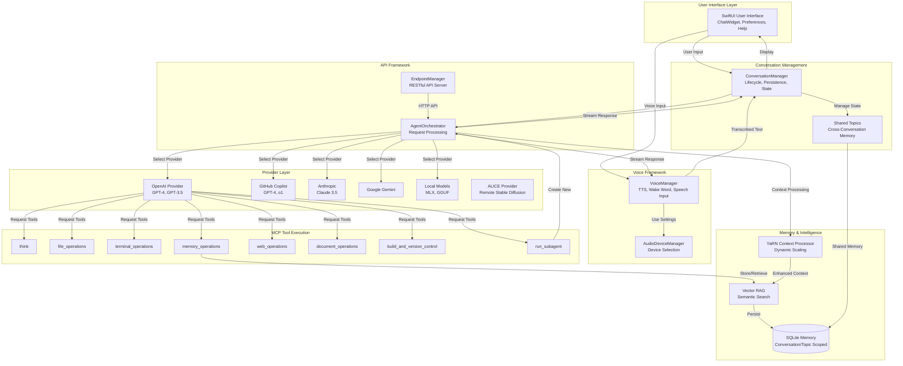
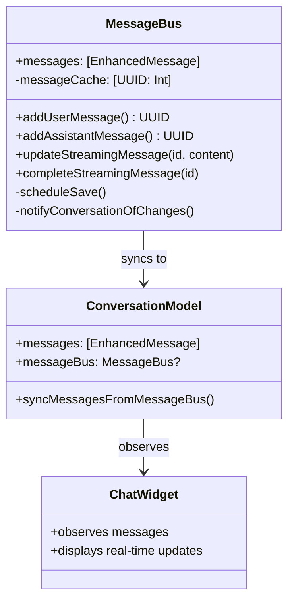
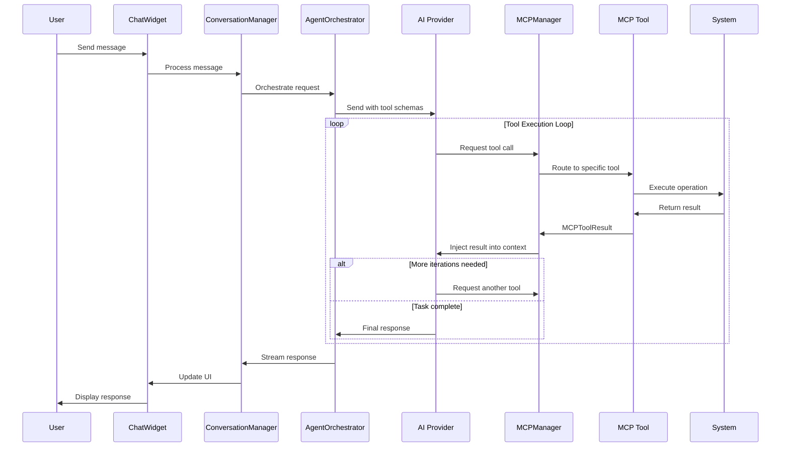

```mermaid
graph TB
    Client[API Client<br/>HTTP POST]
    Router[EndpointManager<br/>Route Handler]
    Validate[Request Validation<br/>Check conversationId]
    Check{Has conversationId?}
    LoadConv[Load Existing<br/>Conversation + Memory]
    NewConv[Create New<br/>Conversation]
    Orchestrator[AgentOrchestrator<br/>Process Request]
    Tools[Tool Execution Loop<br/>MCP Tools]
    StreamCheck{Streaming?}
    SSE[Server-Sent Events<br/>data: &#123;...&#125;]
    JSON[JSON Response<br/>&#123;...&#125;]
    
    Client -->|POST /api/chat/completions| Router
    Router --> Validate
    Validate --> Check
    Check -->|Yes| LoadConv
    Check -->|No| NewConv
    LoadConv -->|With context| Orchestrator
    NewConv -->|No context| Orchestrator
    Orchestrator -->|Execute| Tools
    Tools -->|Results| Orchestrator
    Orchestrator --> StreamCheck
    StreamCheck -->|stream=true| SSE
    StreamCheck -->|stream=false| JSON
    SSE -->|Stream chunks| Client
    JSON -->|Complete response| Client
```

# SAM Architecture

**Deep dive into how SAM works under the hood.**

Thinking about contributing to SAM? Integrating it into your product? Or just curious how a conversational AI with memory, RAG, and tool execution works? This guide explains SAM's architecture from the ground up.

**What you'll learn:**
- High-level system architecture and design philosophy
- How the memory system stores and retrieves context
- Tool system implementation (MCP framework)
- API server architecture and endpoints
- Data flow through the entire stack
- Technology choices and why they were made

**Who this is for:**
- Developers contributing to SAM
- Engineers integrating SAM into products
- Architects evaluating SAM for their stack
- Anyone who wants to understand the internals

**Prerequisites:**
- Familiarity with Swift and SwiftUI
- Understanding of REST APIs and SSE
- Basic knowledge of vector databases and embeddings (for memory system)

Let's explore how SAM's components work together to create an intelligent, capable AI assistant.

---

## Table of Contents

1. [System Overview](#system-overview)
2. [Core Components](#core-components)
3. [Memory & Intelligence Layer](#memory--intelligence-layer)
4. [Tool System Architecture](#tool-system-architecture)
5. [API Server Architecture](#api-server-architecture)
6. [Data Flow](#data-flow)
7. [Technology Stack](#technology-stack)

---

## System Overview

SAM is built as a native macOS application using SwiftUI with a modular, layered architecture.

**Key Principles**:
- **Modularity**: Clear separation of concerns between components
- **Extensibility**: Easy to add new providers, tools, and features
- **Privacy**: Local-first design with optional cloud integration
- **Performance**: Native Swift with Metal acceleration for local models

**High-Level Architecture**:



---

## Core Components

### 1. ConversationManager
**Location**: Sources/ConversationEngine/ConversationManager.swift

**Responsibilities**:
- Manages conversation lifecycle (create, load, save, delete)
- Handles message persistence and retrieval
- Integrates with the memory system
- Coordinates with AI providers

**Key Classes**:
- `ConversationManager`: Main orchestrator
- `ConversationModel`: Conversation data model
- `EnhancedMessage`: Message with metadata
- `MessageBus`: Single source of truth for messages

**State Management**:
```swift
@Published public var conversations: [ConversationModel]
@Published public var activeConversation: ConversationModel?
public let memoryManager = MemoryManager()
public let vectorRAGService: VectorRAGService
public let yarnContextProcessor: YaRNContextProcessor
```

**Per-Conversation Storage Architecture**:
```
~/Library/Application Support/SAM/conversations/
├── {UUID}/
│   ├── conversation.json    # Single conversation data
│   ├── tasks.json           # Agent todo list
│   └── .vectorrag/          # Conversation-scoped RAG
├── active-conversation.json
└── backups/
```

Each conversation is stored in its own directory, providing:
- O(1) save time per conversation (vs O(n) with monolithic file)
- Backward-compatible migration from legacy `conversations.json`
- Automatic cleanup when conversations are deleted

### 2. MessageBus Architecture
**Location**: Sources/ConversationEngine/MessageBus.swift

The MessageBus implements the **Single Source of Truth** pattern for all message operations.

**Architecture**:


**Key Principles**:
- All message creation/updates go through MessageBus
- ConversationModel is read-only mirror (updated by MessageBus)
- ChatWidget observes ConversationModel, never modifies directly
- O(1) message lookup via messageCache

**Performance**:
- 30 FPS streaming throttle for UI updates
- Delta sync to ConversationModel (no array copy)
- Debounced persistence (500ms)

### 3. AgentOrchestrator
**Location**: Sources/APIFramework/AgentOrchestrator.swift

**Responsibilities**:
- Executes autonomous workflows
- Implements tool calling loop (VS Code Copilot pattern)
- Manages iteration budget and limits
- Handles context pruning with YaRN integration

**Key Features**:
- Sequential thinking architecture
- Loop detection and prevention
- Dynamic iteration adjustment
- Subagent spawning

**Workflow Loop**:
```swift
1. Receive user message
2. Add to context
3. Call LLM with available tools
4. Parse tool calls
5. Execute tools
6. Inject results
7. Continue until completion or iteration limit
```

### 4. MemoryManager
**Location**: Sources/ConversationEngine/MemoryManager.swift

**Responsibilities**:
- Stores and retrieves memories
- Enforces conversation/topic scoping
- Manages database lifecycle

**Storage**:
- SQLite database per conversation
- Lazy loading on-demand
- Automatic cleanup

**Operations**:
```swift
func storeMemory(content: String, conversationId: UUID, ...)
func retrieveRelevantMemories(for query: String, ...)
func searchAllConversations(query: String, ...)
```

---

## Memory & Intelligence Layer

### Vector RAG Service
**Location**: Sources/ConversationEngine/VectorRAGService.swift

**Architecture**:
```
Document Input
    ↓
DocumentChunker (semantic chunking)
    ↓
EmbeddingGenerator (512-d vectors via Apple NaturalLanguage)
    ↓
MemoryManager (SQLite storage with vectors)
    ↓
Semantic Search (cosine similarity)
    ↓
Ranked Results
```

**Components**:
- **DocumentChunker**: Intelligent content segmentation
- **EmbeddingGenerator**: Apple NaturalLanguage integration
- **ProcessedChunk**: Container for chunks + embeddings
- **SemanticSearchResult**: Search results with scoring

**Key Algorithms**:
```swift
func chunkDocument(_ document: RAGDocument) -> [DocumentChunk]
func generateEmbedding(for text: String) -> [Double]
func semanticSearch(query: String, threshold: Double) -> [Result]
```

### YaRN Context Processor
**Location**: Sources/ConversationEngine/YaRNContextProcessor.swift

**Purpose**: Dynamic context window management with intelligent compression

**Profiles**:
```swift
public static let `default` = YaRNConfig(
    baseContextLength: 8192,
    extendedContextLength: 32768,
    scalingFactor: 4.0,
    attentionFactor: 0.1,
    compressionThreshold: 0.8
)

public static let mega = YaRNConfig(
    baseContextLength: 65536,
    extendedContextLength: 134217728, // 128M
    scalingFactor: 2048.0,
    attentionFactor: 0.001,
    compressionThreshold: 0.95
)
```

**Processing Pipeline**:
```
1. Analyze message importance
2. Identify preservation candidates
3. Apply semantic clustering
4. Calculate compression targets
5. Generate compressed context
6. Archive rolled-off messages to ContextArchiveManager
7. Cache result
```

### Context Archive System
**Location**: Sources/ConversationEngine/ContextArchiveManager.swift

When YaRN compresses conversations, older messages are archived rather than discarded.

**Architecture**:
```
Active Context (Fits model window)
    ↓ YaRN Compression
Rolled-Off Messages
    ↓
ContextArchiveManager (SQLite)
    ↓
recall_history Tool (MCP)
    ↓
Agent retrieves archived context on demand
```

**Key Features**:
- SQLite-backed storage for archived context
- Topic-wide search capability for shared topics
- Preserves rolled-off messages with summaries and key topics
- On-demand retrieval via `recall_history` tool

### Shared Topics
**Location**: Sources/SharedData/SharedTopicManager.swift

**Architecture**:
```
Topic Storage (SQLite shared-data.db)
    ↓
Topic Metadata (id, name, description)
    ↓
Workspace Directory (~/SAM/{topic-name}/)
    ↓
Effective Scope Resolution
    ↓
Memory/File/Terminal Operations
```

**Effective Scope Pattern**:
```swift
let effectiveScopeId = if sharedTopicEnabled {
    topic.id
} else {
    conversation.id
}
```

---

## Tool System Architecture

### MCP Framework
**Location**: Sources/MCPFramework/

**Tool Interface**:
```swift
public protocol MCPTool {
    var name: String { get }
    var description: String { get }
    var parameters: [String: MCPToolParameter] { get }
    
    func execute(parameters: [String: Any], context: MCPExecutionContext) async -> MCPToolResult
}
```

**Consolidated Tools**:
```swift
public protocol ConsolidatedMCP: MCPTool {
    var supportedOperations: [String] { get }
    func route(operation: String, params: [String: Any], context: MCPExecutionContext) async -> MCPToolResult
}
```

**Core MCP Tools**:
1. `think` - Planning and analysis
2. `increase_max_iterations` - Dynamic iteration management
3. `read_tool_result` - Large result retrieval
4. `user_collaboration` - User input requests
5. `file_operations` - File operations (read, search, write)
6. `terminal_operations` - Terminal operations and session management
7. `memory_operations` - Memory operations (store, search, list)
8. `recall_history` - Search archived conversation context
9. `build_and_version_control` - Build and git operations
10. `web_operations` - Web operations
11. `document_operations` - Document operations
12. `image_generation` - Stable Diffusion
13. `run_subagent` - Subagent spawning
14. `list_system_prompts` - Prompt discovery
15. `list_mini_prompts` - Mini prompt discovery

### Tool Execution Flow



---

## API Server Architecture

### EndpointManager
**Location**: Sources/APIFramework/EndpointManager.swift

**OpenAI-Compatible Endpoints**:
```
POST /api/chat/completions
POST /api/chat/autonomous
GET  /api/models
GET  /v1/conversations
POST /v1/conversations
GET  /v1/conversations/{id}
```

**SSE Streaming**:
```swift
func streamResponse() -> AsyncThrowingStream<ChatResponseChunk, Error> {
    AsyncThrowingStream { continuation in
        // Stream chunks as they arrive
        continuation.yield(chunk)
        continuation.finish()
    }
}
```

**Architecture**:



---

## Data Flow

### Message Flow

```
User Input
    ↓
ChatWidget (UI)
    ↓
ConversationManager.addMessage()
    ↓
Persistence (debounced)
    ↓
EndpointManager.processMessage()
    ↓
AgentOrchestrator.executeAutonomousWorkflow()
    ↓
LLM API Call (streaming)
    ↓
Tool Execution (if needed)
    ↓
Response Assembly
    ↓
UI Update
```

### Memory Storage Flow

```
Content to Store
    ↓
MemoryManager.storeMemory()
    ↓
EmbeddingGenerator.generate()
    ↓
SQLite INSERT with vector
    ↓
Tags + Metadata
    ↓
Success
```

### Memory Retrieval Flow

```
Search Query
    ↓
EmbeddingGenerator.generate()
    ↓
SQLite Vector Search (cosine similarity)
    ↓
Filter by threshold
    ↓
Rank by similarity
    ↓
Return top N results
```

### Document Import Flow

```
File Drop/Selection
    ↓
DocumentImportSystem
    ↓
Format Detection (PDF, DOCX, etc.)
    ↓
Text Extraction
    ↓
Page-Aware Chunking
    ↓
VectorRAGService.ingestDocument()
    ↓
EmbeddingGenerator (per chunk)
    ↓
MemoryManager.storeMemory()
    ↓
Indexed and searchable
```

---

## Technology Stack

### Frontend
- **SwiftUI**: Modern declarative UI framework
- **Combine**: Reactive programming
- **AppKit Integration**: Terminal, file pickers

### Backend
- **Swift 5.9+**: Type-safe, performant
- **Vapor** (API Server): HTTP routing, SSE streaming
- **Logging**: Swift Logging framework

### Storage
- **SQLite**: Conversation and memory storage
- **FileManager**: Workspace file operations
- **Keychain**: Secure API key storage

### AI Integration
- **OpenAI SDK**: GPT-4, GPT-3.5-turbo
- **GitHub Copilot**: OAuth + API integration
- **MLX**: Apple Silicon local inference
- **llama.cpp**: Cross-platform GGUF models
- **NaturalLanguage**: Vector embeddings

### Image Generation
- **Stable Diffusion (CoreML)**: Apple's optimized SD
- **Python Diffusers**: Full feature support, LoRA compatible
- **ALICE Provider**: Remote GPU generation (AMD/NVIDIA)
- **Metal**: GPU acceleration

### Voice & Sound
- **NSSpeechSynthesizer**: Native macOS text-to-speech
- **CoreAudio**: Audio device enumeration and selection
- **AVAudioEngine**: Voice input processing
- **Streaming TTS**: Sentence-by-sentence speech during LLM streaming

### Terminal
- **PTY (pseudo-terminal)**: Full terminal emulation
- **Process**: Subprocess management

---

## Design Patterns

### Dependency Injection
```swift
public init(
    endpointManager: EndpointManager,
    conversationService: SharedConversationService,
    conversationManager: ConversationManager,
    maxIterations: Int = 300
) {
    self.endpointManager = endpointManager
    self.conversationService = conversationService
    self.conversationManager = conversationManager
    self.maxIterations = maxIterations
}
```

### Protocol-Oriented Design
```swift
public protocol AIProviderProtocol: AnyObject {
    func processStreamingChatCompletion(...) async throws -> AsyncThrowingStream<...>
}
```

### Observable Objects
```swift
@MainActor
public class ConversationManager: ObservableObject {
    @Published public var conversations: [ConversationModel]
    @Published public var activeConversation: ConversationModel?
}
```

### Async/Await
```swift
public func executeAutonomousWorkflow(...) async throws -> String {
    let response = try await provider.processChatCompletion(...)
    return response
}
```

---

## Security Architecture

**Authorization**:
- Working directory: Auto-approved
- Outside working directory: Requires user confirmation
- Path normalization prevents `../` attacks

**API Keys**:
- Stored in macOS Keychain
- Never logged or transmitted (except to provider)
- Encrypted at rest

**HTTPS Enforcement**:
- All web operations require HTTPS
- HTTP URLs auto-converted to HTTPS

**Sandboxing**:
- File operations respect authorization
- Terminal operations require approval
- Tool permissions configurable

---

## Performance Considerations

**Lazy Loading**:
- Memory databases loaded on-demand
- Vector embeddings generated as needed
- Conversation history paginated

**Context Caching**:
- YaRN caches processed context per conversation
- Token counting cached
- Embedding vectors cached

**Debounced Persistence**:
- Conversations saved in batches (500ms debounce)
- Prevents excessive disk I/O

**Streaming**:
- SSE streaming for real-time responses
- Reduces perceived latency
- Better UX for long responses

---

## Extension Points

**Adding New Providers**:
1. Implement `AIProviderProtocol`
2. Add to `EndpointManager.providers`
3. Add UI in Preferences

**Adding New Tools**:
1. Create class implementing `MCPTool` or `ConsolidatedMCP`
2. Register in `MCPManager.initializeBuiltinTools()`
3. Add to tool catalog

**Custom System Prompts**:
1. Create in Preferences → System Prompts
2. Variables: `{{working_directory}}`, `{{date}}`, etc.
3. Available in all conversations

---

## Further Reading

- **[API Reference](api-reference.md)** - REST API documentation
- **[Contributing](contributing.md)** - How to contribute
- **[Building](building.md)** - Build from source
- **[Templates](templates/)** - Ready-to-use prompts, handoffs, and tools

---

**Understand SAM's architecture to extend and customize effectively!**
