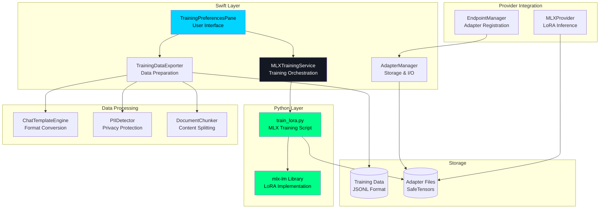

# SAM Architecture

**Deep dive into how SAM works under the hood.**

Thinking about contributing to SAM? Integrating it into your product? Or just curious how a conversational AI with memory, RAG, and tool execution works? This guide explains SAM's architecture from the ground up.

**What you'll learn:**
- High-level system architecture and design philosophy
- How the memory system stores and retrieves context
- Tool system implementation (MCP framework)
- API server architecture and endpoints
- Data flow through the entire stack
- Technology choices and why they were made

**Who this is for:**
- Developers contributing to SAM
- Engineers integrating SAM into products
- Architects evaluating SAM for their stack
- Anyone who wants to understand the internals

**Prerequisites:**
- Familiarity with Swift and SwiftUI
- Understanding of REST APIs and SSE
- Basic knowledge of vector databases and embeddings (for memory system)

Let's explore how SAM's components work together to create an intelligent, capable AI assistant.

---

## Table of Contents

1. [System Overview](#system-overview)
2. [Core Components](#core-components)
3. [Memory & Intelligence Layer](#memory--intelligence-layer)
4. [Tool System Architecture](#tool-system-architecture)
5. [LoRA Training System](#lora-training-system)
6. [API Server Architecture](#api-server-architecture)
7. [Data Flow](#data-flow)
8. [Technology Stack](#technology-stack)

---

## System Overview

SAM is built as a native macOS application using SwiftUI with a modular, layered architecture.

**Key Principles**:
- **Modularity**: Clear separation of concerns between components
- **Extensibility**: Easy to add new providers, tools, and features
- **Privacy**: Local-first design with optional cloud integration
- **Performance**: Native Swift with Metal acceleration for local models

**High-Level Architecture**:


---

## Core Components

### 1. ConversationManager
**Location**: Sources/ConversationEngine/ConversationManager.swift

**Responsibilities**:
- Manages conversation lifecycle (create, load, save, delete)
- Handles message persistence and retrieval
- Integrates with the memory system
- Coordinates with AI providers

**Key Classes**:
- `ConversationManager`: Main orchestrator
- `ConversationModel`: Conversation data model
- `EnhancedMessage`: Message with metadata
- `MessageBus`: Single source of truth for messages

**State Management**:
```swift
@Published public var conversations: [ConversationModel]
@Published public var activeConversation: ConversationModel?
public let memoryManager = MemoryManager()
public let vectorRAGService: VectorRAGService
public let yarnContextProcessor: YaRNContextProcessor
```

**Per-Conversation Storage Architecture**:
```
~/Library/Application Support/SAM/conversations/
├── {UUID}/
│   ├── conversation.json    # Single conversation data
│   ├── tasks.json           # Agent todo list
│   └── .vectorrag/          # Conversation-scoped RAG
├── active-conversation.json
└── backups/
```

Each conversation is stored in its own directory, providing:
- O(1) save time per conversation (vs O(n) with monolithic file)
- Backward-compatible migration from legacy `conversations.json`
- Automatic cleanup when conversations are deleted

### 2. MessageBus Architecture
**Location**: Sources/ConversationEngine/MessageBus.swift

The MessageBus implements the **Single Source of Truth** pattern for all message operations.

**Architecture**:


**Key Principles**:
- All message creation/updates go through MessageBus
- ConversationModel is read-only mirror (updated by MessageBus)
- ChatWidget observes ConversationModel, never modifies directly
- O(1) message lookup via messageCache

**Performance**:
- 30 FPS streaming throttle for UI updates
- Delta sync to ConversationModel (no array copy)
- Debounced persistence (500ms)

### 3. AgentOrchestrator
**Location**: Sources/APIFramework/AgentOrchestrator.swift

**Responsibilities**:
- Executes autonomous workflows
- Implements tool calling loop (VS Code Copilot pattern)
- Manages iteration budget and limits
- Handles context pruning with YaRN integration

**Key Features**:
- Sequential thinking architecture
- Loop detection and prevention
- Dynamic iteration adjustment
- Subagent spawning

**Workflow Loop**:
```swift
1. Receive user message
2. Add to context
3. Call LLM with available tools
4. Parse tool calls
5. Execute tools
6. Inject results
7. Continue until completion or iteration limit
```

### 4. MemoryManager
**Location**: Sources/ConversationEngine/MemoryManager.swift

**Responsibilities**:
- Stores and retrieves memories
- Enforces conversation/topic scoping
- Manages database lifecycle

**Storage**:
- SQLite database per conversation
- Lazy loading on-demand
- Automatic cleanup

**Operations**:
```swift
func storeMemory(content: String, conversationId: UUID, ...)
func retrieveRelevantMemories(for query: String, ...)
func searchAllConversations(query: String, ...)
```

---

## Memory & Intelligence Layer

### Vector RAG Service
**Location**: Sources/ConversationEngine/VectorRAGService.swift

**Architecture**:
```
Document Input
    ↓
DocumentChunker (semantic chunking)
    ↓
EmbeddingGenerator (512-d vectors via Apple NaturalLanguage)
    ↓
MemoryManager (SQLite storage with vectors)
    ↓
Semantic Search (cosine similarity)
    ↓
Ranked Results
```

**Components**:
- **DocumentChunker**: Intelligent content segmentation
- **EmbeddingGenerator**: Apple NaturalLanguage integration
- **ProcessedChunk**: Container for chunks + embeddings
- **SemanticSearchResult**: Search results with scoring

**Key Algorithms**:
```swift
func chunkDocument(_ document: RAGDocument) -> [DocumentChunk]
func generateEmbedding(for text: String) -> [Double]
func semanticSearch(query: String, threshold: Double) -> [Result]
```

### YaRN Context Processor
**Location**: Sources/ConversationEngine/YaRNContextProcessor.swift

**Purpose**: Dynamic context window management with intelligent compression

**Profiles**:
```swift
public static let `default` = YaRNConfig(
    baseContextLength: 8192,
    extendedContextLength: 32768,
    scalingFactor: 4.0,
    attentionFactor: 0.1,
    compressionThreshold: 0.8
)

public static let mega = YaRNConfig(
    baseContextLength: 65536,
    extendedContextLength: 134217728, // 128M
    scalingFactor: 2048.0,
    attentionFactor: 0.001,
    compressionThreshold: 0.95
)
```

**Processing Pipeline**:
```
1. Analyze message importance
2. Identify preservation candidates
3. Apply semantic clustering
4. Calculate compression targets
5. Generate compressed context
6. Archive rolled-off messages to ContextArchiveManager
7. Cache result
```

### Context Archive System
**Location**: Sources/ConversationEngine/ContextArchiveManager.swift

When YaRN compresses conversations, older messages are archived rather than discarded.

**Architecture**:
```
Active Context (Fits model window)
    ↓ YaRN Compression
Rolled-Off Messages
    ↓
ContextArchiveManager (SQLite)
    ↓
recall_history Tool (MCP)
    ↓
Agent retrieves archived context on demand
```

**Key Features**:
- SQLite-backed storage for archived context
- Topic-wide search capability for shared topics
- Preserves rolled-off messages with summaries and key topics
- On-demand retrieval via `recall_history` tool

### Shared Topics
**Location**: Sources/SharedData/SharedTopicManager.swift

**Architecture**:
```
Topic Storage (SQLite shared-data.db)
    ↓
Topic Metadata (id, name, description)
    ↓
Workspace Directory (~/SAM/{topic-name}/)
    ↓
Effective Scope Resolution
    ↓
Memory/File/Terminal Operations
```

**Effective Scope Pattern**:
```swift
let effectiveScopeId = if sharedTopicEnabled {
    topic.id
} else {
    conversation.id
}
```

---

## Tool System Architecture

### MCP Framework
**Location**: Sources/MCPFramework/

**Tool Interface**:
```swift
public protocol MCPTool {
    var name: String { get }
    var description: String { get }
    var parameters: [String: MCPToolParameter] { get }
    
    func execute(parameters: [String: Any], context: MCPExecutionContext) async -> MCPToolResult
}
```

**Consolidated Tools**:
```swift
public protocol ConsolidatedMCP: MCPTool {
    var supportedOperations: [String] { get }
    func route(operation: String, params: [String: Any], context: MCPExecutionContext) async -> MCPToolResult
}
```

**Core MCP Tools**:
1. `think` - Planning and analysis
2. `increase_max_iterations` - Dynamic iteration management
3. `read_tool_result` - Large result retrieval
4. `user_collaboration` - User input requests
5. `file_operations` - File operations (read, search, write)
6. `terminal_operations` - Terminal operations and session management
7. `memory_operations` - Memory operations (store, search, list)
8. `recall_history` - Search archived conversation context
9. `build_and_version_control` - Build and git operations
10. `web_operations` - Web operations
11. `document_operations` - Document operations
12. `image_generation` - Stable Diffusion
13. `run_subagent` - Subagent spawning
14. `list_system_prompts` - Prompt discovery
15. `list_mini_prompts` - Mini prompt discovery

### Tool Execution Flow


---

## API Server Architecture

### EndpointManager
**Location**: Sources/APIFramework/EndpointManager.swift

**OpenAI-Compatible Endpoints**:
```
POST /api/chat/completions
POST /api/chat/autonomous
GET  /api/models
GET  /v1/conversations
POST /v1/conversations
GET  /v1/conversations/{id}
```

**SSE Streaming**:
```swift
func streamResponse() -> AsyncThrowingStream<ChatResponseChunk, Error> {
    AsyncThrowingStream { continuation in
        // Stream chunks as they arrive
        continuation.yield(chunk)
        continuation.finish()
    }
}
```

**Architecture**:


---

## Data Flow

### Message Flow

```
User Input
    ↓
ChatWidget (UI)
    ↓
ConversationManager.addMessage()
    ↓
Persistence (debounced)
    ↓
EndpointManager.processMessage()
    ↓
AgentOrchestrator.executeAutonomousWorkflow()
    ↓
LLM API Call (streaming)
    ↓
Tool Execution (if needed)
    ↓
Response Assembly
    ↓
UI Update
```

### Memory Storage Flow

```
Content to Store
    ↓
MemoryManager.storeMemory()
    ↓
EmbeddingGenerator.generate()
    ↓
SQLite INSERT with vector
    ↓
Tags + Metadata
    ↓
Success
```

### Memory Retrieval Flow

```
Search Query
    ↓
EmbeddingGenerator.generate()
    ↓
SQLite Vector Search (cosine similarity)
    ↓
Filter by threshold
    ↓
Rank by similarity
    ↓
Return top N results
```

### Document Import Flow

```
File Drop/Selection
    ↓
DocumentImportSystem
    ↓
Format Detection (PDF, DOCX, etc.)
    ↓
Text Extraction
    ↓
Page-Aware Chunking
    ↓
VectorRAGService.ingestDocument()
    ↓
EmbeddingGenerator (per chunk)
    ↓
MemoryManager.storeMemory()
    ↓
Indexed and searchable
```

---

## LoRA Training System

SAM includes a complete LoRA (Low-Rank Adaptation) training system for fine-tuning local MLX models on custom data.

### Training Architecture

**Components:**



### Training Pipeline

**Phase 1: Data Preparation (Swift)**

1. **Export Sources:**
   - Conversations exported from chat interface
   - Documents imported and chunked
   - Both produce JSONL training data

2. **Data Processing:**
   ```swift
   // TrainingDataExporter.swift
   public func exportConversation(
       conversationId: UUID,
       template: ChatTemplate,
       enablePIIDetection: Bool
   ) -> TrainingDataset
   ```
   
3. **PII Detection (if enabled):**
   ```swift
   // PIIDetector.swift (Actor-based)
   let detected = await piiDetector.detectPII(in: text)
   let sanitized = await piiDetector.stripPII(from: text)
   ```
   
   Detects and redacts 9 PII types:
   - Personal names (NaturalLanguage framework)
   - Organizations, places (NaturalLanguage framework)
   - Email addresses, phone numbers (regex patterns)
   - Credit cards, SSNs, IPs, URLs (regex patterns)

4. **Chat Template Formatting:**
   ```swift
   // ChatTemplateEngine.swift (Actor-based)
   let formatted = await chatEngine.format(
       userMessage: userText,
       assistantMessage: assistantText,
       template: .llama3,  // or .mistral, .qwen, .gemma, .phi, .custom
       systemPrompt: systemPrompt
   )
   ```
   
   Supported templates:
   - Llama 3/4: `<|begin_of_text|><|start_header_id|>...`
   - Mistral: `<s>[INST] ... [/INST] ...</s>`
   - Qwen 2.5: `<|im_start|>user\n...<|im_end|>`
   - Gemma 2/3: `<start_of_turn>user\n...<end_of_turn>`
   - Phi 3: `<|user|>\n...<|end|>`
   - Custom: Generic markdown format

5. **Document Chunking:**
   ```swift
   // DocumentChunker.swift
   public func chunkDocument(
       content: String,
       strategy: ChunkingStrategy,
       maxTokens: Int
   ) -> [String]
   ```
   
   Three strategies:
   - **Semantic**: Natural paragraph boundaries
   - **Fixed Size**: Uniform token-sized chunks with overlap
   - **Page Aware**: Respect PDF page boundaries

**Phase 2: Training Invocation (Swift → Python)**

```swift
// MLXTrainingService.swift
public func startTraining(
    dataPath: String,
    modelPath: String,
    adapterName: String,
    rank: Int,
    learningRate: Double,
    epochs: Int,
    batchSize: Int
) async throws
```

1. **Parameter Validation:**
   - Verify model path exists
   - Check training data format
   - Validate parameter ranges

2. **Python Process Spawn:**
   ```swift
   let python = pythonEnvironment.pythonExecutable
   let script = Bundle.main.path(forResource: "train_lora", ofType: "py")
   
   process.arguments = [
       script,
       "--model", modelPath,
       "--data", dataPath,
       "--rank", String(rank),
       "--learning-rate", String(learningRate),
       "--num-epochs", String(epochs),
       "--batch-size", String(batchSize)
   ]
   
   process.launch()
   ```

3. **Progress Monitoring:**
   - Reads Python stdout for progress updates
   - Parses JSON-formatted training metrics
   - Updates UI with epoch, step, loss values

**Phase 3: Training Execution (Python)**

```python
# scripts/train_lora.py

import mlx.core as mx
from mlx_lm import load, lora

# Load base model
model, tokenizer = load(model_path)

# Configure LoRA
lora_config = {
    "rank": rank,
    "alpha": alpha,
    "dropout": 0.0,
    "target_modules": ["q_proj", "k_proj", "v_proj", "o_proj"]
}

# Train
model = lora.train(
    model=model,
    tokenizer=tokenizer,
    data=training_data,
    config=lora_config,
    learning_rate=learning_rate,
    num_epochs=num_epochs,
    batch_size=batch_size
)

# Save adapter
adapter_path = output_dir / "adapters.safetensors"
mx.savez(adapter_path, **lora_params)
```

**Training Loop:**
```python
for epoch in range(num_epochs):
    for batch in data_loader:
        # Forward pass
        logits = model(batch["input_ids"])
        
        # Compute loss
        loss = cross_entropy(logits, batch["labels"])
        
        # Backward pass (gradient computation)
        loss.backward()
        
        # Update LoRA weights only
        optimizer.step()
        
        # Report progress
        print(json.dumps({
            "epoch": epoch,
            "step": step,
            "loss": float(loss)
        }))
```

**Phase 4: Adapter Storage (Swift)**

```swift
// AdapterManager.swift (Actor-based)
public func saveAdapter(_ adapter: LoRAAdapter) async throws {
    let adapterDir = adaptersDirectory
        .appendingPathComponent(adapter.id)
    
    // Create directory structure
    try FileManager.default.createDirectory(at: adapterDir)
    
    // Save metadata
    let metadata = AdapterMetadata(
        name: adapter.name,
        baseModel: adapter.baseModelName,
        trainingDataset: adapter.trainingDataset,
        createdAt: Date(),
        finalLoss: adapter.finalLoss,
        rank: adapter.rank,
        learningRate: adapter.learningRate,
        epochs: adapter.epochs,
        trainingSteps: adapter.trainingSteps
    )
    
    let metadataPath = adapterDir.appendingPathComponent("metadata.json")
    try JSONEncoder().encode(metadata).write(to: metadataPath)
    
    // Adapter weights saved by Python script:
    // - adapters.safetensors (LoRA weights)
    // - adapter_config.json (MLX configuration)
}
```

**Storage Structure:**
```
~/Library/Application Support/SAM/adapters/
├── {adapter-uuid-1}/
│   ├── adapters.safetensors      # LoRA weights (20-50MB typical)
│   ├── adapter_config.json        # MLX LoRA config
│   └── metadata.json              # Training metadata
├── {adapter-uuid-2}/
│   └── ...
```

**Phase 5: Provider Registration (Swift)**

```swift
// EndpointManager.swift
private func scanForAdapters() {
    let adapters = adapterManager.loadAllAdapters()
    
    for adapter in adapters {
        // Create LoRA provider for this adapter
        let provider = MLXProvider(
            modelPath: adapter.baseModelPath,
            adapterPath: adapter.adapterPath,
            modelName: "lora/\(adapter.name)"
        )
        
        // Register with model manager
        modelManager.registerProvider(provider)
    }
}
```

**Adapter Discovery:**
- Scans `~/Library/Application Support/SAM/adapters/` on startup
- Reads metadata.json for each adapter
- Creates MLXProvider instances with adapter configuration
- Adapters appear in model picker with `lora/` prefix

### Inference with LoRA Adapters

**Adapter Loading:**

```swift
// MLXProvider.swift
public func loadModel() async throws {
    // Load base model
    let baseModel = try await MLX.load(modelPath: basePath)
    
    // Load LoRA adapter if specified
    if let adapterPath = adapterPath {
        let adapter = try await MLX.loadLoRA(path: adapterPath)
        
        // Apply LoRA to base model
        model = baseModel.applyLoRA(adapter)
    } else {
        model = baseModel
    }
}
```

**LoRA Application:**
```swift
// AppleMLXAdapter.swift
private func applyLoRAWeights(
    baseModel: MLXModel,
    adapterPath: String
) throws -> MLXModel {
    // Load adapter weights
    let weights = loadSafetensors(path: adapterPath)
    
    // For each attention layer
    for layer in baseModel.layers {
        if let loraA = weights["layer.\(layer.id).q_proj.lora_a"],
           let loraB = weights["layer.\(layer.id).q_proj.lora_b"] {
            // W' = W + (B × A) × scale
            let delta = loraB.matmul(loraA).multiply(scale)
            layer.q_proj.weight = layer.q_proj.weight.add(delta)
        }
        // Repeat for k_proj, v_proj, o_proj
    }
    
    return baseModel
}
```

**Inference Flow:**
1. User selects `lora/AdapterName` in model picker
2. MLXProvider loads base model + adapter
3. LoRA weights applied to attention layers
4. Model runs inference with adapted weights
5. Minimal overhead (LoRA is efficient)

### Training Data Models

**Core Data Structures:**

```swift
// TrainingDataModels.swift

public struct TrainingExample: Codable, Sendable {
    public let userMessage: String
    public let assistantMessage: String
    public let systemPrompt: String?
}

public struct JSONLEntry: Codable, Sendable {
    public struct Message: Codable {
        public let role: String  // "system", "user", "assistant"
        public let content: String
    }
    
    public let messages: [Message]
}

public struct ExportOptions: Sendable {
    public enum ChunkingStrategy: String, CaseIterable, Sendable {
        case semantic = "Semantic (Paragraphs)"
        case fixedSize = "Fixed Size"
        case pageAware = "Page Aware (PDFs)"
    }
    
    public let chunkingStrategy: ChunkingStrategy
    public let maxChunkTokens: Int
    public let enablePIIDetection: Bool
    public let template: ChatTemplate
}

public struct ExportStatistics: Sendable {
    public let totalExamples: Int
    public let totalTokens: Int
    public let averageTokensPerExample: Int
    public let piiEntitiesRedacted: [PIIEntity: Int]
    public let outputFileSize: Int
}
```

### Training Parameters

**Configurable via UI:**

| Parameter | Type | Range | Default | Purpose |
|-----------|------|-------|---------|---------|
| **Rank** | Int | 4-128 | 8 | LoRA adapter capacity |
| **Alpha** | Double | - | 16 | LoRA scaling factor (fixed) |
| **Learning Rate** | Double | 0.00001-0.01 | 0.0001 | Training step size |
| **Epochs** | Int | 1-50 | 3 | Training passes |
| **Batch Size** | Int | 1-32 | 4 | Examples per step |

**Target Layers (Fixed):**
- `q_proj` (Query projection)
- `k_proj` (Key projection)
- `v_proj` (Value projection)
- `o_proj` (Output projection)

### Technology Integration

**Swift Components:**
- Swift 6 strict concurrency (Actor-based services)
- Combine for reactive progress updates
- FileManager for adapter I/O
- UserDefaults for training settings
- SwiftUI for training UI

**Python Components:**
- **mlx-lm**: MLX LoRA training library
- **mlx.core**: Apple MLX framework
- **safetensors**: Efficient weight storage
- **tokenizers**: HuggingFace tokenizer library

**Python Environment:**
- Bundled with SAM (no user installation)
- Located in `Contents/Resources/python-environment/`
- Includes all dependencies (mlx, mlx-lm, safetensors)

### Performance Characteristics

**Training Speed:**
- Rank 8, 3 epochs, 100 examples: ~5-10 minutes (M1/M2/M3)
- Rank 32, 10 epochs, 500 examples: ~30-60 minutes (M1/M2/M3)
- Scales with model size, dataset size, parameters

**Memory Usage:**
- Base model loaded into unified memory
- Optimizer state (2x model size during training)
- Recommend 16GB+ RAM for 7B models

**Adapter File Sizes:**
- Rank 8: ~15-25MB
- Rank 16: ~30-60MB
- Rank 32: ~60-120MB
- Rank 64: ~120-250MB
- Rank 128: ~250-500MB

**Inference Overhead:**
- LoRA application: <100ms (one-time at model load)
- Per-token latency: <1% increase vs base model
- Memory overhead: Adapter size + base model

### Error Handling

**Training Failures:**
- Invalid JSONL format detection
- Model compatibility validation
- Out-of-memory graceful failure
- Training interruption handling
- Automatic cleanup on failure

**Adapter Loading:**
- Missing adapter files detection
- Incompatible base model detection
- Corrupted weight file handling
- Graceful fallback to base model

### Future Enhancements

**Potential Additions:**
- Multi-adapter merging
- Adapter quantization
- Training resume from checkpoint
- Hyperparameter auto-tuning
- Validation set early stopping
- GGUF model support (llama.cpp LoRA)

---

## Technology Stack

### Frontend
- **SwiftUI**: Modern declarative UI framework
- **Combine**: Reactive programming
- **AppKit Integration**: Terminal, file pickers

### Backend
- **Swift 5.9+**: Type-safe, performant
- **Vapor** (API Server): HTTP routing, SSE streaming
- **Logging**: Swift Logging framework

### Storage
- **SQLite**: Conversation and memory storage
- **FileManager**: Workspace file operations
- **Keychain**: Secure API key storage

### AI Integration
- **OpenAI SDK**: GPT-4, GPT-3.5-turbo
- **GitHub Copilot**: OAuth + API integration
- **MLX**: Apple Silicon local inference
- **llama.cpp**: Cross-platform GGUF models
- **NaturalLanguage**: Vector embeddings

### Image Generation
- **Stable Diffusion (CoreML)**: Apple's optimized SD
- **Python Diffusers**: Full feature support, LoRA compatible
- **ALICE Provider**: Remote GPU generation (AMD/NVIDIA)
- **Metal**: GPU acceleration

### Voice & Sound
- **NSSpeechSynthesizer**: Native macOS text-to-speech
- **CoreAudio**: Audio device enumeration and selection
- **AVAudioEngine**: Voice input processing
- **Streaming TTS**: Sentence-by-sentence speech during LLM streaming

### Terminal
- **PTY (pseudo-terminal)**: Full terminal emulation
- **Process**: Subprocess management

---

## Design Patterns

### Dependency Injection
```swift
public init(
    endpointManager: EndpointManager,
    conversationService: SharedConversationService,
    conversationManager: ConversationManager,
    maxIterations: Int = 300
) {
    self.endpointManager = endpointManager
    self.conversationService = conversationService
    self.conversationManager = conversationManager
    self.maxIterations = maxIterations
}
```

### Protocol-Oriented Design
```swift
public protocol AIProviderProtocol: AnyObject {
    func processStreamingChatCompletion(...) async throws -> AsyncThrowingStream<...>
}
```

### Observable Objects
```swift
@MainActor
public class ConversationManager: ObservableObject {
    @Published public var conversations: [ConversationModel]
    @Published public var activeConversation: ConversationModel?
}
```

### Async/Await
```swift
public func executeAutonomousWorkflow(...) async throws -> String {
    let response = try await provider.processChatCompletion(...)
    return response
}
```

---

## Security Architecture

**Authorization**:
- Working directory: Auto-approved
- Outside working directory: Requires user confirmation
- Path normalization prevents `../` attacks

**API Keys**:
- Stored in macOS Keychain
- Never logged or transmitted (except to provider)
- Encrypted at rest

**HTTPS Enforcement**:
- All web operations require HTTPS
- HTTP URLs auto-converted to HTTPS

**Sandboxing**:
- File operations respect authorization
- Terminal operations require approval
- Tool permissions configurable

---

## Performance Considerations

**Lazy Loading**:
- Memory databases loaded on-demand
- Vector embeddings generated as needed
- Conversation history paginated

**Context Caching**:
- YaRN caches processed context per conversation
- Token counting cached
- Embedding vectors cached

**Debounced Persistence**:
- Conversations saved in batches (500ms debounce)
- Prevents excessive disk I/O

**Streaming**:
- SSE streaming for real-time responses
- Reduces perceived latency
- Better UX for long responses

---

## Extension Points

**Adding New Providers**:
1. Implement `AIProviderProtocol`
2. Add to `EndpointManager.providers`
3. Add UI in Preferences

**Adding New Tools**:
1. Create class implementing `MCPTool` or `ConsolidatedMCP`
2. Register in `MCPManager.initializeBuiltinTools()`
3. Add to tool catalog

**Custom System Prompts**:
1. Create in Preferences → System Prompts
2. Variables: `{{working_directory}}`, `{{date}}`, etc.
3. Available in all conversations

---

## Further Reading

- **[API Reference](api-reference.md)** - REST API documentation
- **[Contributing](contributing.md)** - How to contribute
- **[Building](building.md)** - Build from source
- **[Templates](templates/)** - Ready-to-use prompts, handoffs, and tools

---

**Understand SAM's architecture to extend and customize effectively!**
