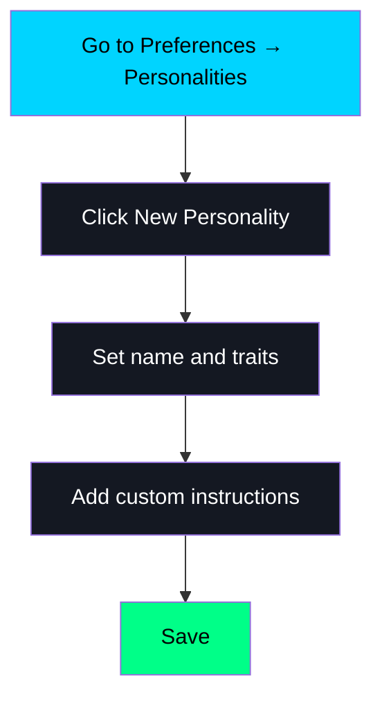

# SAM Features Overview

**The AI that works *with* you, not just *for* you.**

Most AI assistants are conversation partners. SAM is a **collaborator**. It doesn't just answer questions. It reads your codebase, remembers your decisions, executes multi-step plans, and keeps everything private on your Mac.

**Here's what that means in practice:**
- Ask about a decision you made two weeks ago, and SAM finds it
- Drop a 200-page PDF and ask about chapter 7. SAM knows.
- Say "refactor this authentication system" and SAM plans, implements, tests, and iterates
- Work on a complex project where multiple specialized agents share context automatically

This guide shows you everything SAM can do, with real examples you can try today.

---

## Table of Contents

1. [Core Features](#core-features)
2. [Voice Input and Output](#voice-input-and-output)
3. [Personality System](#personality-system)
4. [Memory & Intelligence](#memory--intelligence)
5. [Context Archive & Recall](#context-archive--recall)
6. [Document Understanding](#document-understanding)
7. [Multi-Conversation Collaboration](#multi-conversation-collaboration)
8. [Autonomous Workflows](#autonomous-workflows)
9. [File & Code Operations](#file--code-operations)
10. [Web Research](#web-research)
11. [Terminal Integration](#terminal-integration)
12. [Image Generation](#image-generation)
13. [Location Awareness](#location-awareness)
14. [API & Integration](#api--integration)

---

## Core Features

### Multiple AI Providers

SAM works with multiple AI providers, giving you flexibility and choice:

**Cloud Providers:**
- **OpenAI**: GPT-4, GPT-4-turbo, O1/O3 reasoning models
- **GitHub Copilot**: GPT-4, Claude 3.5 Sonnet, o1-preview (secure Device Flow auth)
- **Anthropic**: Claude 3.5 Sonnet, Claude 4, Claude 4.5 Sonnet
- **Google Gemini**: Gemini 1.5 Pro, Gemini 1.5 Flash, Gemini 2.0 Flash Thinking Experimental
- **DeepSeek**: DeepSeek models for cost-effective inference
- **Custom**: Connect to any OpenAI-compatible API (Grok, Ollama, etc.)

**Local Models:**
- **MLX** (Apple Silicon): Near-native speed with Metal acceleration, per-conversation KV cache for 10x faster switching
- **GGUF via llama.cpp** (All Macs): Wide model compatibility with quantization support, state serialization for fast context restore

**Benefits**:
- Switch between providers without restarting
- Use local models for complete privacy
- Fall back to different providers if one is unavailable
- Compare responses from different models
- GitHub Copilot uses secure Device Flow authentication (no manual key entry)

**How to Configure Providers**:
1. Go to **SAM → Preferences → Remote Providers**
2. Click **Add Provider** button
3. Select provider type from the dropdown
4. Enter your API key (or click **Use GitHub Authentication** for GitHub Copilot)
5. Click **Test Connection** to verify
6. Click **Save Provider**

**Switching Models in a Conversation**:
- Click the **model picker** in the conversation toolbar
- Select any configured model
- Change takes effect for the next message

---

### Voice Input and Output

Go hands-free with SAM's voice capabilities. Enable wake word detection and text-to-speech for natural conversations without touching your keyboard.

**Wake Word ("Hey SAM")**

When enabled, SAM listens for "Hey SAM" and starts voice input automatically.

**How to Enable:**
1. Go to **SAM → Preferences → Voice**
2. Toggle **Enable Wake Word Detection**
3. Grant microphone permission when prompted
4. Say "Hey SAM" followed by your request

**Voice Input (Push-to-Talk)**

Even without wake word detection, you can use voice input:
- Press **⌘K** (or click the microphone button) to start recording
- Speak your message
- Recording stops automatically when you pause, or press ⌘K again
- Your speech is transcribed and sent to SAM

**Voice Output (Text-to-Speech)**

Have SAM read responses aloud for a true conversational experience.

**How to Enable:**
1. Go to **SAM → Preferences → Sound**
2. Toggle **Enable Text-to-Speech**
3. Select your preferred voice from the dropdown
4. Adjust speech rate with the slider (0.5x - 1.5x)
5. Click **Test Voice** to preview

**Streaming TTS (New in December 2025)**

SAM speaks sentences as they're generated - no waiting for the complete response:
- Sentences are queued and spoken in order
- Natural pauses between sentences
- Stop button clears speech queue immediately

**Sound Preferences:**
- **Input Device**: Select microphone for voice input
- **Output Device**: Select speakers for TTS output
- **Voice Selection**: Choose from available system voices (English voices shown)
- **Speech Rate**: Adjust speaking speed (0.5x slow to 1.5x fast)

**Tips:**
- Combine wake word + text-to-speech for completely hands-free operation
- Great for cooking, exercising, or when your hands are busy
- Works with all providers and models
- Voice settings are per-conversation customizable

---

### Conversation Management

SAM provides powerful conversation organization features to help you manage your work.

**Sidebar Organization:**
- **Collapsible Folders**: Organize conversations into folders that expand/collapse
- **Conversation Filter**: Type to instantly filter conversations by title
- **Pinned Conversations**: Pin important conversations to prevent auto-cleanup
- **Uncategorized Section**: Collapsible section for unfiled conversations

**Draft Message Persistence (New):**
- Draft messages are automatically saved per conversation
- Switch between conversations without losing your in-progress text
- Drafts persist across app restarts
- Stable Diffusion prompts also persist across restarts

**Keyboard Shortcuts:**
- **⌘↑** / **⌘↓**: Scroll conversation up/down
- **⌘T**: Toggle tools on/off
- **⌘K**: Start voice input
- **Escape**: Stop current generation

**Conversation Settings:**
- **Reasoning enabled by default** for new conversations
- Sidebar opens expanded by default for better visibility
- Tooltips on Model, Prompt, and Personality labels

---

### Session Intelligence

Track your conversation's resource usage and monitor autonomous agent workflows in real time with Session Intelligence.

**What Session Intelligence Shows:**

- **Tokens Used**: Total tokens consumed in the current conversation
- **Cost Estimate**: Estimated cost in USD based on provider pricing
- **Iterations**: Number of autonomous workflow cycles executed
- **Tools Called**: Count of tool invocations during agent execution
- **Active Provider**: Which AI provider is handling the conversation

**How to Access:**

1. Look for the Session Intelligence icon in the conversation toolbar
2. Click to expand the panel and view detailed metrics
3. Metrics update in real time as the conversation progresses

**Use Cases:**

**Budget Awareness**
```
Monitor costs as you work with cloud providers
See exactly how much each conversation costs
Compare costs across different models
```

**Workflow Monitoring**
```
Track autonomous agent progress
See iteration counts during multi-step tasks
Understand how many tools were invoked
```

**Performance Insights**
```
Compare token usage across different models
Identify conversations consuming excessive resources
Optimize prompts based on token metrics
```

**Provider Visibility**
```
Confirm which provider is handling your request
Useful when switching between multiple providers
Verify correct model/provider selection
```

**Benefits:**
- Complete transparency into AI usage and costs
- Real-time feedback during autonomous workflows
- Helps optimize prompts and model selection
- Essential for multi-step agent tasks

---

## Personality System

SAM includes a comprehensive personality system that lets you customize how the AI communicates and behaves. Choose from built-in personalities or create your own.

### How Personalities Work


Each personality combines:
- **Traits**: Settings for tone, formality, verbosity, humor, and teaching style
- **Custom Instructions**: Detailed behavior guidelines specific to that persona

When you select a personality, SAM adjusts how it communicates and approaches problems. The personality is applied through the system prompt, so it affects all responses.

### Personality Gallery (22 Built-In)

#### General (3)

| Personality | Description | Best For |
|-------------|-------------|----------|
| **Assistant** | Balanced, helpful, professional | Default for most tasks |
| **Professional** | Formal, concise, action-oriented | Business communication |
| **Coach** | Motivational, encouraging | Goal-setting, accountability |

#### Creative & Writing (5)

| Personality | Description | Best For |
|-------------|-------------|----------|
| **Muse** | Brainstorming partner, sparks imagination | Ideation, creative projects |
| **Wordsmith** | Encouraging writing assistant | Drafts, prose, storytelling |
| **Document Assistant** | Document formatting and organization | Reports, documentation |
| **Image Architect** | Transforms ideas into visual descriptions | Image generation prompts |
| **Artist** | Creative soul with artistic appreciation | Art direction, aesthetics |

#### Tech (4)

| Personality | Description | Best For |
|-------------|-------------|----------|
| **Tech Buddy** | Friendly tech support for all levels | Non-technical users |
| **Tinkerer** | Hands-on problem solver | Practical coding help |
| **Crusty Coder** | Battle-scarred veteran, strong opinions | Experienced developers |
| **BOFH** | The legendary Bastard Operator From Hell | IT humor, sysadmin tasks |

#### Productivity (1)

| Personality | Description | Best For |
|-------------|-------------|----------|
| **Motivator** | Productivity buddy, beats procrastination | Task management, focus |

#### Domain Experts (6)

| Personality | Description | Best For |
|-------------|-------------|----------|
| **Doctor** | 7-step clinical diagnostic methodology | Health questions (with disclaimers) |
| **Counsel** | IRAC legal analysis framework | Legal concepts (not legal advice) |
| **Finance Coach** | Financial literacy guide | Budgeting, financial planning |
| **Trader** | Options trading analyst | Trading concepts, analysis |
| **Scientist** | Research-focused analytical thinking | Scientific questions, research |
| **Philosopher** | Deep thinking and conceptual exploration | Ethics, meaning, big questions |

#### Fun & Character (3)

| Personality | Description | Best For |
|-------------|-------------|----------|
| **Comedian** | Comedy toolkit with timing and techniques | Entertainment, humor |
| **Pirate** | Arr! Nautical flair | Fun conversations |
| **Time Traveler** | Historical perspectives across eras | History, speculation |
| **Jester** | Playful trickster with clever wit | Games, playfulness |

### Selecting a Personality

**For a Single Conversation:**
Click the personality picker in the conversation header and choose from the list.

**Set Your Default Personality:**
1. Go to **SAM → Preferences → Personalities**
2. Find the **"Default for New Conversations"** dropdown at the top
3. Select the personality you want as default
4. All new conversations will use this personality

### Creating Custom Personalities



1. Go to **SAM → Preferences → Personalities**
2. Click **New Personality** button
3. Enter name and description
4. Select trait settings:
   - **Tone**: Professional, friendly, enthusiastic, grumpy, sarcastic, empathetic, motivational
   - **Formality**: Formal, casual, relaxed
   - **Verbosity**: Concise, balanced, detailed, verbose
   - **Humor**: Serious, witty, comedic
   - **Teaching Style**: Direct, Socratic, story-based, technical, patient
5. Add custom instructions (optional)
6. Click **Create Personality**

**Custom Instructions Example:**
```
You are a senior Swift developer specializing in iOS and macOS apps.
Always suggest modern Swift patterns and avoid deprecated APIs.
Explain technical decisions with brief rationale.
```

### Mini-Prompts: Contextual Information

Mini-prompts let you inject consistent context into conversations without repeating yourself. They're perfect for personal information, project details, preferences, or location-based context.

**What They Do:**
- Add automatic context to every message
- Toggle on/off per conversation
- No need to repeat information
- Lightweight and flexible

**How to Use:**
1. Click **Mini-Prompts** button in toolbar
2. Create prompts for common context:
   - Personal details (name, role, preferences)
   - Project information (tech stack, coding style)
   - Location data (for weather, local search)
3. Toggle prompts on/off for each conversation
4. Context is automatically added to your messages

**Example Mini-Prompt:**
```
I'm working on a SwiftUI macOS app. I prefer clean code with
descriptive variable names and comprehensive error handling.
```

**When Enabled:**
Every message you send includes this context, so SAM knows your preferences without you stating them each time.

**Use Cases:**
- Project-specific details (frameworks, languages, constraints)
- Personal coding style preferences
- Location for weather/local queries
- Role-specific context (student, professional, researcher)

**Best Practices:**
- Keep mini-prompts focused and concise
- Use different prompts for different project types
- Disable prompts that aren't relevant to current conversation
- Update prompts as your context changes

---

## Memory & Intelligence

SAM's memory system goes beyond simple conversation history. It understands context, remembers important information, and retrieves relevant details intelligently when you need them.

### Contextual Memory

**What It Is**:
- Storage of important information from conversations (via explicit memory_operations)
- Semantic understanding using 512-dimensional vector embeddings (Apple NaturalLanguage)
- Conversation-scoped or topic-scoped storage

**How It Works**:
1. You or SAM explicitly stores information using memory operations
2. Important information is extracted and processed
3. Content is converted to 512-dimensional vectors
4. Stored in database with metadata
5. Retrieved automatically when relevant to future queries

**Example**:
```
You: Remember that I'm working on a Python web app using Flask
SAM: I'll remember that you're working on a Flask Python web application.

[Later in conversation or different conversation in same topic]

You: What framework am I using for my web app?
SAM: You're using Flask for your Python web application.
```

**Benefits**:
- No need to repeat information
- SAM brings up relevant past context automatically
- Works across long conversations
- Persists beyond conversation lifecycle

### Conversation vs Topic Scoping

**Conversation-Scoped** (Default):
- Each conversation has its own isolated memory
- Privacy: Information stays within the conversation
- Perfect for separate projects or unrelated topics

**Topic-Scoped** (Shared Topics):
- Multiple conversations share the same memory
- Perfect for complex projects with multiple aspects
- Example: Frontend, backend, and testing conversations all access same information

**How to Choose**:
- Use conversation scope for unrelated work
- Use topic scope when multiple conversations work together on one project

### Vector RAG (Retrieval-Augmented Generation)

**What It Is**:
SAM's advanced document understanding system that makes your imported files searchable and intelligent.

**Capabilities**:
- **Semantic Search**: Not just keywords - understands meaning and context
- **Cross-Document**: Search across all imported documents
- **Cross-Conversation**: Find information from any conversation
- **Relevance Scoring**: Results ranked by semantic similarity

**How It Works**:
1. Import documents (PDFs, Word docs, code, images)
2. Documents are split into manageable chunks
3. Each chunk gets a vector embedding for semantic search
4. Stored in vector database
5. Queries use semantic similarity (cosine distance) to find relevant chunks
6. Most relevant chunks retrieved and presented to you

**Similarity Thresholds**:
- **0.15-0.25**: For document and RAG searches
- **0.3-0.5**: For conversation memory searches
- **Lower threshold = More results**: If you get no results, try lowering the threshold

### YaRN Context Processing

**What It Is**:
Dynamic context window management that lets SAM handle everything from quick chats to analyzing massive documents.

**Context Window Profiles**:

| Profile | Scaling | Use Case |
|---------|---------|----------|
| Default | Low | Regular conversations |
| Extended | Medium | Long conversations |
| Universal | High | Modern LLMs, large docs (DEFAULT) |
| Mega | Enterprise | Massive documents and RAG |

**Intelligent Compression**:
- Analyzes message importance
- Preserves critical information
- Compresses less important content
- Uses semantic clustering
- Maintains conversation coherence

**When YaRN Activates**:
- Automatically when context exceeds base window
- Compression triggered at 70% of max tokens
- Transparent to user - just works

**Benefits**:
- Never see "context too long" errors
- Handle massive documents with ease
- Long conversations preserve important context
- Optimized automatically for each model's capabilities

---

## Context Archive & Recall

When YaRN compresses conversations to fit context limits, older messages don't disappear. They're archived for later retrieval.

### How It Works

1. **Automatic Archiving**: When context exceeds model limits, YaRN compresses older messages
2. **Smart Preservation**: Compressed messages are archived with summaries and key topics
3. **SQLite Storage**: Archives stored locally in efficient database format
4. **On-Demand Recall**: Use `recall_history` tool to search archived context

### The recall_history Tool

SAM can search archived conversation history when you need context from earlier discussions:

**Use Cases:**
- Reference earlier decisions in long conversations
- Find information from hours or days ago
- Search across ALL agents in a shared topic
- Recover context that YaRN compressed

**Example:**
```
You: What did we decide about the database schema earlier?

SAM: [Using recall_history]
Found 2 relevant archive chunks from earlier today.

Chunk 1 (10:30-11:15):
Summary: Discussed PostgreSQL vs MongoDB for user data.
Decision: Chose PostgreSQL for relational integrity.

Chunk 2 (11:30-12:00):
Summary: Designed user and profile tables.
Key topics: primary keys, foreign keys, indexes
```

### Topic-Wide Search

When working in a shared topic with multiple agent conversations:
- Search history from ALL agents in the topic
- Find what other specialized agents discussed
- Maintain continuity across agent handoffs

**Example:**
```
You: What did the backend agent implement?

SAM: [Using recall_history with topic_id]
Found context from Backend Agent conversation:
- Implemented JWT authentication endpoints
- Created user registration flow
- Added password hashing with bcrypt
```

### Memory Status Indicator

SAM shows when archived context is available:
```
[Memory Status] 3 archived chunks available (15,000 tokens)
Use recall_history to access earlier context.
```

---

## Document Understanding

### Supported Formats

SAM can import and understand multiple document formats:

**Document Types**:
- **PDF Files**: Text extraction
- **Word Documents**: .docx, .doc with formatting preservation
- **Text Files**: .txt, .md, .rtf, and code files
- **Code Files**: All programming languages

**Import Methods**:
1. **Drag & Drop**: Drag files into chat window
2. **File Browser**: Use document import tool
3. **Bulk Import**: Import entire directories

### Page-Aware Chunking

**What It Is**:
SAM preserves document structure when chunking for better accuracy.

**Benefits**:
- Page boundaries respected
- Section headings preserved
- Context maintained across chunks
- Accurate source references

**Example**:
```
You: Import this 50-page PDF research paper
SAM: Imported "Research Paper.pdf" - 50 pages, 127 chunks created

You: What does page 23 say about methodology?
SAM: On page 23, the methodology section describes... [accurate retrieval from correct page]
```

### Cross-Document Search

**What It Is**:
Search and synthesize information across multiple imported documents.

**Use Cases**:
- Research: Find themes across multiple papers
- Coding: Search code patterns across files
- Documentation: Find answers across user guides
- Legal: Search across contracts and documents

**Example**:
```
You: Search all my imported documents for information about authentication
SAM: Found references in 3 documents:
1. "Backend API.pdf" (page 15): JWT authentication implementation
2. "security-notes.md": OAuth2 flow description  
3. "main.py": Auth middleware code at line 45
```

---

## Multi-Conversation Collaboration

### Shared Topics

**What They Are**:
Named workspaces where multiple conversations can collaborate on the same project.

**Creating a Shared Topic**:
1. Go to **SAM → Preferences → Shared Topics**
2. Under "Create New Topic", enter a topic name (e.g., "My Web App Project")
3. Optionally add a description
4. Click **Create** button

**Using a Shared Topic in a Conversation**:
1. In the conversation toolbar, find the **Shared Topic** toggle
2. Turn it **On** to enable cross-conversation memory
3. Select your topic from the dropdown that appears
4. All file operations now use the shared workspace

**Note**: The Shared Topic toggle appears in the toolbar alongside Tools, Terminal, and Workflow toggles.

**What Gets Shared**:
- Files and folders
- Memory and stored information
- Terminal sessions

**FYI - Storage Location**:
Topics create directories at `~/SAM/{topic-name}/`, but you don't need to manage them directly. SAM handles everything through the UI.

**Real-World Scenario**:

**Goal**: Build a web application

**Setup**:
1. Create shared topic "My Web App"
2. Create conversations:
   - "Backend Development"
   - "Frontend UI"
   - "Testing & QA"
   - "Documentation"

**Workflow**:
- **Backend conversation**: Creates API code in `~/SAM/My Web App/backend/`
- **Frontend conversation**: Creates UI code in `~/SAM/My Web App/frontend/`, reads backend API definitions
- **Testing conversation**: Accesses both backend and frontend code, writes tests
- **Documentation conversation**: Reads all code, generates documentation

**Benefits**:
- Each conversation specialized in its domain
- All access same files and memory
- No manual file copying
- Persistent workspace across conversation lifecycle

### Effective Scope Pattern

**What It Is**:
SAM's system for determining which workspace and memory to use for your work.

**Logic**:
```
IF (shared topic enabled AND topic selected)
    Workspace: ~/SAM/{topic-name}/
    Memory: Shared across all conversations in topic
ELSE
    Workspace: ~/SAM/{conversation-title}/
    Memory: Isolated to this conversation only
```

**Applies To**:
- File operations (all read/write operations)
- Memory operations (store/search)
- Terminal sessions (working directory)
- Document imports (storage location)

---

## Autonomous Workflows

### Sequential Thinking

**What It Is**:
SAM can plan, think through problems, and execute multi-step workflows autonomously.

**Think Tool**:
- Explicit planning before action
- Break down complex tasks
- Analyze problems systematically
- Transparent thought process

**Example**:
```
You: Refactor my authentication system to use JWT tokens

SAM: [Using think tool]
Let me plan this refactoring:
1. Analyze current authentication implementation
2. Design JWT token structure
3. Implement token generation/validation
4. Update existing routes to use JWT
5. Add token refresh mechanism
6. Update tests

[Proceeds to execute each step]
```

### Subagent Delegation

**What It Is**:
SAM can spawn specialized sub-agents to handle different aspects of complex tasks.

**How It Works**:
1. Main conversation identifies need for specialized work
2. Spawns subagent with specific task
3. Subagent has fresh iteration budget
4. Subagent works independently
5. Results returned to main conversation

**Benefits**:
- **Isolation**: Each subagent has clean, focused context
- **Parallelism**: Multiple subagents can work simultaneously
- **Fresh Thinking**: New iteration budget for each complex subtask
- **Specialization**: Each subagent focuses on one specific aspect

**Use Cases**:
- **Code Review**: Spawn subagent to review security, another for performance
- **Research**: Multiple subagents research different aspects
- **Testing**: Dedicated subagent for comprehensive testing
- **Documentation**: Specialized subagent for docs while main works on code

**Example**:
```
You: Build a complete web application with authentication, database, and API

SAM: I'll delegate this to specialized subagents:
1. Spawning "Database Schema" subagent...
2. Spawning "Authentication System" subagent...
3. Spawning "REST API" subagent...

[Each subagent works independently, reports back with results]
```

### Shared Topics + Subagents

**Powerful Combination**:
Enable shared topic, then spawn subagents. All subagents work in the same shared workspace.

**Example Workflow**:
```
Shared Topic: "Full Stack App"

Main Conversation:
├── Subagent: "Backend API" → works in ~/SAM/Full Stack App/backend/
├── Subagent: "Frontend React" → works in ~/SAM/Full Stack App/frontend/
├── Subagent: "Database Schema" → creates ~/SAM/Full Stack App/schema.sql
└── Subagent: "Integration Tests" → reads all code, writes tests
```

All subagents access the same files and memory!

### Iteration Management

**Default Limits**:
- Configurable iteration limits per conversation
- Can be increased dynamically as needed

**Dynamic Iteration Increase**:
SAM can request more iterations if needed:

```
SAM: I'm approaching my iteration limit and still have files to refactor.
Requesting an increase to complete this task properly.
```

**Requirements**:
- Must enable "Dynamic Iterations" in conversation settings
- Must provide clear reason for increase
- Must specify total needed (not additional)

---

## File & Code Operations

### 16 File Operations

SAM has comprehensive file operation capabilities:

**Read Operations** (4):
- `read_file`: Read file contents with optional line range
- `list_dir`: List directory contents
- `get_errors`: Get compilation/lint errors
- `get_search_results`: Get workspace search results

**Search Operations** (5):
- `file_search`: Find files by glob pattern (e.g., `**/*.py`)
- `grep_search`: Regex content search
- `semantic_search`: AI-powered code search
- `list_usages`: Find symbol references
- `search_index`: Search working directory index

**Write Operations** (7):
- `create_file`: Create new files
- `replace_string`: Replace exact text matches
- `multi_replace_string`: Multiple replacements in one operation
- `insert_edit`: Insert content at specific location
- `rename_file`: Rename or move files
- `delete_file`: Delete files
- `apply_patch`: Apply unified diff patches

### Authorization System

**Inside Working Directory**: AUTO-APPROVED
```
~/SAM/My Project/ ← Working directory
├── src/           ← Auto-approved
├── tests/         ← Auto-approved
└── docs/          ← Auto-approved
```

**Outside Working Directory**: REQUIRES AUTHORIZATION
```
~/Documents/       ← Requires approval
/etc/              ← Requires approval
~/.ssh/            ← Requires approval
```

**Benefits**:
- **Safety**: Can't accidentally modify system files
- **Privacy**: Explicit approval required for accessing personal files
- **Transparency**: See exactly what SAM wants to do before it happens

### Semantic Code Search

**What It Is**:
Natural language search across your codebase.

**Example Queries**:
```
Find functions that handle user authentication
Locate where database connections are established
Show me error handling patterns
Find API endpoint definitions
```

**vs. Regular Search**:
- Regular: Matches exact text/patterns
- Semantic: Understands intent and meaning

---

## Web Research

### 6 Web Operations

**research**: Comprehensive multi-source research + automatic memory storage
**retrieve**: Access previously stored research from memory
**web_search**: Quick web search for top results
**serpapi**: Professional search via SerpAPI (Google, Bing, Amazon, etc.)
**scrape**: Extract content from websites (JavaScript-enabled)
**fetch**: Retrieve main content from webpage (faster, basic HTTP)

### Professional Search (SerpAPI)

When enabled, SAM can use SerpAPI for professional-grade search:

**Search Engines**:
- Google Search
- Google AI Overviews
- Bing
- Amazon Products
- eBay
- Walmart
- TripAdvisor
- Yelp
- Google Maps
- Google Scholar

**Example**:
```
You: Search Amazon for the best-rated wireless headphones under $200

SAM: [Uses serpapi with engine=amazon]
Found top-rated headphones:
1. Sony WH-1000XM5 - $199.99 (4.7/5, 12,450 reviews)
2. Bose QuietComfort 45 - $179.99 (4.6/5, 8,230 reviews)
...
```

### Web Scraping

**WebKit Scraping**:
- Full JavaScript support
- Renders pages like a real browser
- Handles dynamic content
- Extracts main article content

**Use Cases**:
- Scrape documentation sites
- Extract article content
- Get structured data from web apps
- Research product information

**Example**:
```
You: Scrape the main content from https://docs.python.org/3/library/asyncio.html

SAM: [Scrapes page with JavaScript rendering]
Retrieved content from "asyncio - Asynchronous I/O"
[Provides clean, formatted content]
```

### Research Workflow

**Comprehensive Research**:
```
You: Research the latest developments in AI safety with comprehensive depth

SAM: [Uses research operation]
1. Searching multiple sources...
2. Scraping relevant articles...
3. Synthesizing information...
4. Storing in memory for future reference...

[Provides comprehensive summary with sources]
```

**Retrieve Later**:
```
You: [In a new conversation or same one later]
What did we learn about AI safety?

SAM: [Uses retrieve operation]
Retrieved research about AI safety from memory:
[Pulls from previously stored research]
```

---

## Terminal Integration

### 11 Terminal Operations

**Execution**:
- `run_command`: Execute shell commands
- `get_output`: Get command output
- `get_last_command`: Get last executed command

**Session Management**:
- `create_session`: Create new terminal session
- `attach_session`: Attach to existing session
- `detach_session`: Detach from session
- `switch_session`: Switch between sessions
- `close_session`: Close terminal session
- `list_sessions`: List all sessions

**Interaction**:
- `send_input`: Send input to running command
- `get_state`: Get terminal state

### Persistent Terminals

**Per-Conversation Terminals**:
- Each conversation has dedicated terminal
- History persists across app restarts
- Working directory matches conversation/topic workspace

**Visible Terminal Integration**:
- Toggle terminal panel in the UI
- Watch commands execute in real-time
- See output as it happens
- Interactive command support

**Note**: Press **⌘T** to toggle tools on/off (including terminal access).

**Example Workflow**:
```
You: Run my Python tests

SAM: [Executes in terminal]
$ pytest tests/
====== test session starts ======
collected 42 items

tests/test_auth.py ........ [ 19%]
tests/test_api.py ......... [ 40%]
...
====== 42 passed in 2.35s ======

Tests passed! All 42 tests successful.
```

---

## Image Generation

### Getting Started with Image Generation

SAM includes built-in AI image generation that runs entirely on your Mac. Generate images from text descriptions with just a few clicks.

**Quick Start (3 Steps)**:
1. **Install a Model**: Go to **Preferences → Image Generation → Model Browser**
2. **Download**: Find a model you like and download it (with optional CoreML conversion)
3. **Generate**: Type your prompt in chat or ask SAM to generate an image

### Installing Image Models

**From the Model Browser**:
1. Open **SAM → Preferences → Image Generation**
2. Choose **HuggingFace** or **CivitAI** tab
3. Search by name, tags, or browse popular models
4. Click **Download** on any model
5. Optionally click **Convert** to optimize for your Mac (recommended for Apple Silicon)
6. Model appears in your model picker automatically

**Model Types**:
- **SD 1.5**: 512×512 images, fast, wide variety of styles
- **SD 2.x**: 768×768 images, improved quality
- **SDXL**: 1024×1024 images, highest quality (slower)

**Tip**: Start with SD 1.5 models since they're faster and have the most community options.

### Two Ways to Generate Images

**LLM-Assisted Mode** (Recommended for beginners):
Just ask SAM naturally. It handles the technical details.

```
You: Generate an image of a serene mountain landscape at sunset

SAM: [Using image_generation]
Generating with optimal settings...
- Enhanced prompt with lighting and quality details
- Selected appropriate negative prompts
- Image saved and displayed
```

**Direct SD Mode** (Fast and precise):
1. Click the **model picker** in your conversation
2. Select an SD model (look for models prefixed with "sd/")
3. Type your exact prompt
4. Press Enter and the image generates immediately

The send button turns **purple** when in Direct SD Mode.

**Benefits of Direct SD Mode**:
- **Faster**: Skips LLM processing entirely
- **Precise**: Your exact words go to the image generator
- **Cost-effective**: No API calls to cloud providers

### Model & LoRA Browsers

Discover and download models and LoRAs directly in SAM through integrated browsers.

**Model Browser** (Preferences → Image Generation → Model Browser):
- **CivitAI Tab**: Browse thousands of community Stable Diffusion models
- **HuggingFace Tab**: Discover models from HuggingFace Hub
- Search, filter, preview, and download with one click
- Auto-convert to CoreML for Mac optimization

**LoRA Browser** (Preferences → Image Generation → LoRA Browser):
- **Library Tab**: Manage your installed LoRAs
- **CivitAI Tab**: Browse and download LoRAs from CivitAI
- **HuggingFace Tab**: Discover LoRAs from HuggingFace Hub
- Filter by base model (SD 1.5, SDXL, Z-Image, Flux)
- View trigger words and compatibility info
- Auto-load results when switching tabs

**Using LoRAs**:
Just reference the LoRA filename in your image prompt. SAM automatically finds and applies it.

**Tip**: Ask SAM "list available LoRAs" to see all installed LoRAs with their trigger words.

### ALICE Remote Generation

Generate images on remote GPU servers using the ALICE protocol. Perfect for:
- AMD GPU hardware (not supported locally on Mac)
- Steam Deck or Linux servers
- Offloading generation while working

**Setup**:
1. Open **Preferences → Stable Diffusion → Settings**
2. Enter your ALICE server URL (e.g., `http://192.168.1.100:8090/v1`)
3. Click **Test Connection**
4. Save and models will appear in picker with "ALICE" location

**Benefits**:
- Use AMD or NVIDIA GPUs remotely
- Keep Mac responsive during generation
- Access server-side models without downloading

### Generation Tips

**Write Better Prompts**:
- Be specific: "Serene mountain landscape at sunset" beats "mountains"
- Add style: "watercolor painting of...", "photo-realistic...", "digital art of..."
- Include details: lighting, mood, colors, composition
- Use quality tags: "8k", "detailed", "masterpiece"

**Adjust Settings** (available in Preferences → Image Generation):
- **Steps**: More steps = better quality, slower generation (default: 25)
- **Guidance Scale**: Higher = stricter prompt adherence (default: 8.0)
- **Scheduler**: Try DPM++ with Karras for best results

---

## Location Awareness

SAM can incorporate location context into conversations, enabling more relevant and personalized responses.

### Two Location Modes

**General Location** (Manual):
- Enter your location manually in Preferences → General → Location
- Example: "Austin, TX" or "London, UK"
- No device permissions required
- Perfect for privacy-conscious users

**Precise Location** (Automatic):
- Toggle **Use Precise Location** in Preferences → General
- Uses Core Location for automatic detection
- City-level accuracy (not exact GPS coordinates)
- Updates automatically when you travel
- Requires location permission approval

### Privacy First

Location data is handled with privacy as the top priority:
- **Local Only**: Location never sent to external servers
- **City-Level**: Precise location uses kilometer accuracy, not GPS coordinates
- **Opt-In**: Empty by default, you choose if and when to share
- **UserDefaults Storage**: Stored locally, never transmitted

### How Location Helps

When location is configured, SAM can provide:
- **Weather-appropriate suggestions**: "It's winter in Chicago, dress warmly"
- **Local recommendations**: Nearby restaurants, stores, services
- **Time-zone awareness**: Meeting scheduling, deadlines
- **Regional context**: Local regulations, customs, language variations

**Example:**
```
[With location set to "Seattle, WA"]

You: What's good for lunch nearby?

SAM: Since you're in Seattle, here are some popular options:
- Pike Place Chowder (seafood)
- Salumi (Italian deli)
- Din Tai Fung (dumplings)
Would you like me to search for specific cuisines?
```

### Configuration

1. **General Location**: Go to **SAM → Preferences → General**, find the **Location** section, and enter your location in the "General Location" field (e.g., "Austin, TX")
2. **Precise Location**: In the same section, toggle **Use Precise Location**. SAM will request location permission the first time.

---

## API & Integration

### RESTful API

SAM includes a built-in REST API compatible with OpenAI's format.

**Endpoints**:
- `POST /api/chat/completions` - Chat completions
- `POST /api/chat/autonomous` - Autonomous workflows
- `GET /api/models` - List available models
- `GET /v1/conversations` - List conversations
- `POST /v1/conversations` - Create conversation

**Streaming Support**:
All chat endpoints support Server-Sent Events (SSE) for real-time streaming.

**Enhanced Response Metadata**:
SAM enriches API responses with a `sam_metadata` field containing:
- **Provider Info**: Which provider fulfilled the request, local vs remote
- **Model Info**: Context window size, capabilities (tools, vision, streaming)
- **Workflow Info**: Iterations, tool calls, duration (for autonomous requests)
- **Cost Estimate**: Estimated USD cost with per-1K token rates

**Example**:
```bash
curl -X POST http://localhost:8080/api/chat/completions \
  -H "Content-Type: application/json" \
  -d '{
    "model": "gpt-4",
    "messages": [{"role": "user", "content": "Hello!"}],
    "stream": true
  }'
```

**Use Cases**:
- Integrate SAM with other applications
- Automate workflows via API
- Build custom interfaces
- Script complex operations
- Monitor token usage and costs

### Configuration

**API Server Settings**:
- **Port**: Default 8080 (configurable)
- **Authentication**: Optional for localhost
- **CORS**: Configurable for web access

See [API Reference](../developer/api-reference.md) for complete documentation.

---

## Next Steps

Now that you understand SAM's features, dive deeper into specific topics:

**Essential Guides**:
- **[Memory & RAG](memory-and-rag.md)** - Master SAM's memory system
- **[Shared Topics](shared-topics.md)** - Multi-conversation workflows
- **[Advanced Workflows](../power-user/advanced-workflows.md)** - Subagents and complex projects

**Power User**:
- **[Tools Reference](../power-user/tools-reference.md)** - Complete tools reference
- **[Configuration](../power-user/configuration.md)** - Complete settings guide
- **[Troubleshooting](../power-user/troubleshooting.md)** - Common issues

**Developer**:
- **[API Reference](../developer/api-reference.md)** - REST API documentation
- **[Architecture](../developer/architecture.md)** - System internals

---

**Ready to explore?** Start with the feature that interests you most!
