# Getting Started with SAM

**Your AI assistant that actually remembers, actually works, and actually finishes projects.**

You're about to meet an AI that doesn't just chat. It collaborates. SAM reads your code, understands your documents, executes commands, and remembers everything across days and weeks of conversations. No more re-explaining context. No more copy-pasting between windows. Just describe what you need, and watch it happen.

**This guide takes about 10 minutes.** By the end, you'll have SAM running with your preferred AI provider, and you'll understand the features that make it unlike any AI assistant you've used before.

**What makes SAM different:**
- **Memory that persists**: Recall decisions from last week without digging through chat history
- **Documents become knowledge**: Drop a PDF and ask questions about any page
- **Autonomous execution**: SAM doesn't just suggest. It builds, tests, and iterates.
- **Complete privacy**: Your data stays on your Mac. Always.

Let's get you set up.

---

## Table of Contents

1. [Prerequisites](#prerequisites)
2. [Installation](#installation)
3. [First Launch & Setup](#first-launch--setup)
4. [Your First Conversation](#your-first-conversation)
5. [Configuring AI Providers](#configuring-ai-providers)
6. [Understanding the Interface](#understanding-the-interface)
7. [Next Steps](#next-steps)

---

## Prerequisites

Before installing SAM, ensure you have:

- **macOS 14.0 (Sonoma) or later**
- **4GB+ available RAM** (8GB+ recommended for local models)
- **4GB+ free disk space**
- **Internet connection** (for cloud providers and downloads)

**For cloud AI providers (optional)**:
- [OpenAI API key](https://platform.openai.com/api-keys) - GPT-4, GPT-3.5-turbo, and more
- [GitHub Copilot subscription](https://github.com/features/copilot) - GitHub Copilot integration
- Anthropic Claude API key - Claude models
- Google AI API key - Gemini models

**For local models (optional)**:
- Apple Silicon Mac (M1/M2/M3/M4) - MLX models
- Any Mac (Intel or Apple Silicon) - GGUF models via llama.cpp

---

## Installation

### Method 1: Download Pre-built App (Recommended)

The easiest way to install SAM - just download, extract, and run.

**Step 1: Download SAM**
1. Visit the [Releases page](https://github.com/SyntheticAutonomicMind/SAM/releases)
2. Download the latest `SAM.app.zip` file
3. File size: Approximately 150MB

**Step 2: Extract the Archive**
1. Double-click `SAM.app.zip` to extract
2. You'll get `SAM.app`

**Step 3: Move to Applications**
Drag `SAM.app` to your Applications folder, or use Terminal:
```bash
mv ~/Downloads/SAM.app /Applications/
```

**Step 4: First Launch (Important)**
macOS Gatekeeper will block unsigned apps on first launch. To open SAM:

1. **Right-click** (or Control-click) `SAM.app` in Applications
2. Select **"Open"** from the menu
3. Click **"Open"** in the security dialog
4. This step is only needed once

**Alternative: Command Line**
If you get a "damaged app" error, remove the quarantine attribute:
```bash
xattr -d com.apple.quarantine /Applications/SAM.app
```

### Method 2: Build from Source

For developers or advanced users who want to build SAM from source.

**Prerequisites**:
- Xcode 15.0+ with Command Line Tools
- Git
- Homebrew (optional, for dependencies)

**Build Steps**:
```bash
# Clone the repository
git clone https://github.com/SyntheticAutonomicMind/SAM.git
cd SAM

# Initialize submodules (llama.cpp for local models)
git submodule update --init --recursive

# Build debug version (faster, includes debug symbols)
make build-debug

# Or build release version (optimized)
make build-release

# Launch SAM
open .build/Build/Products/Debug/SAM.app
# or
open .build/Build/Products/Release/SAM.app
```

For complete build instructions, see [Building from Source](../developer/building.md).

---

## First Launch & Setup

When you launch SAM for the first time, you'll go through a quick setup process.

### Grant Permissions

SAM will request the following permissions:

**Network Access**
- Required to connect to AI providers (OpenAI, Copilot, etc.)
- Click "Allow" when prompted

**File Access** (optional, on first file operation)
- Needed if you want SAM to read/write files in your home directory
- You can grant this later when needed

**Location Access** (optional)
- Enables location-aware responses
- City-level accuracy only (privacy-focused)
- Can be configured later in Preferences

### Welcome Screen

On first launch, you'll see options to:

1. **Start with Cloud Provider** (Recommended for beginners)
   - Requires API key
   - Fast setup, latest models
   - Best for trying SAM quickly

2. **Download Local Model**
   - No API keys needed
   - Works offline
   - Slower but private
   - Best for privacy-conscious users

3. **Take a Tour**
   - Quick overview of SAM's features
   - Recommended for first-time users

### Choose Your Path

**Quick Start: Cloud Provider**
- Fast to set up
- Access to latest models (GPT-4, etc.)
- Requires API key from provider
- → Continue to [Configuring AI Providers](#configuring-ai-providers)

**Privacy-First: Local Model**
- No API keys needed
- Works completely offline
- Takes longer to download models
- → See [Using Local Models](#using-local-models) below

---

## Your First Conversation

Ready to chat with SAM? Let's send your first message!

### Step 1: Create a Conversation

SAM automatically creates a "New Conversation" when you first launch it. You can also create new conversations anytime:
- Click the **"+"** button in the sidebar
- Press **⌘ + N** (keyboard shortcut)

### Step 2: Select a Model and Personality

Choose a model from the dropdown at the top of the conversation:

**Cloud Provider (OpenAI)**:
- `gpt-4` - Best quality (slower, costs more)
- `gpt-3.5-turbo` - Good quality (faster, costs less)

**Local Model**:
- Select your downloaded model
- Listed by name and provider (MLX/GGUF)

**Select a Personality** (Optional):
Click the personality selector next to the model picker:
- **Assistant** (default): Balanced, helpful, professional
- **Tinkerer**: Hands-on problem solver with community-first mentorship
- **Wordsmith**: Encouraging writing assistant for prose and documentation
- **Muse**: Brainstorming and creative ideation
- And 20 more specialized personalities

### Step 3: Send Your First Message

Type a message in the input field at the bottom and press Enter:

**Example First Message**:
```
Hello! Can you explain what you can do and what makes you special?
```

SAM will respond in real-time, explaining its capabilities and unique features.

### Step 4: Try Some Basic Tasks

Once SAM responds, try these tasks to see its capabilities:

**Ask for Information**:
```
What are the main features that make SAM different from other AI assistants?
```

**Request File Operations**:
```
Create a file called hello.txt with "Hello from SAM!" in my home directory
```

**Test Memory**:
```
Remember that my favorite programming language is Python
```

Then in a new message:
```
What's my favorite programming language?
```

SAM will retrieve this from memory and respond correctly.

**Work with Attached Files**:
Click the paperclip button in the chat input area, select a file (PDF, text, code, etc.), and ask:
```
Summarize this document for me
```

Files are automatically imported before your message is sent, so SAM can access their content immediately.

**Web Research** (requires API provider):
```
Search the web for the latest news about AI developments
```

---

## Configuring AI Providers

To use cloud AI providers, you need to configure API keys.

### OpenAI Setup

**Step 1: Get Your API Key**
1. Go to [platform.openai.com/api-keys](https://platform.openai.com/api-keys)
2. Sign in or create an account
3. Click "Create new secret key"
4. **Copy the key** (starts with `sk-`)
5. **Save it immediately** - OpenAI only shows it once!

**Step 2: Add to SAM**
1. Open SAM Preferences (press ⌘, or choose SAM → Preferences)
2. Click **API Endpoints** tab
3. Click **Add Provider** button
4. Select **OpenAI** from the provider type dropdown
5. Paste your API key
6. Click **Test** to verify (optional)
7. Click **Save Provider**

**Step 3: Start Using**
- Select an OpenAI model (gpt-4, gpt-3.5-turbo) in the model dropdown
- Start chatting!

### GitHub Copilot Setup

GitHub Copilot uses **Device Flow authentication** - no API keys to copy/paste!

**Step 1: Activate Subscription**
1. Go to [github.com/features/copilot](https://github.com/features/copilot)
2. Subscribe to GitHub Copilot (free trial available)

**Step 2: Authenticate in SAM**
1. Open SAM Preferences (⌘,)
2. Click **API Endpoints** tab
3. Click **Add Provider** button, then select **GitHub Copilot**
4. Click **Authenticate with GitHub**
5. SAM displays a **user code** (e.g., "ABCD-1234")
6. Your browser opens to GitHub's device verification page
7. Enter the code and click **Continue**
8. Click **Authorize** to grant SAM access
9. Return to SAM - authentication completes automatically

**Step 3: Use Copilot Models**
- Select a Copilot model from the dropdown
- Available models: GPT-4, Claude 3.5 Sonnet, o1-preview, o1-mini

**Note**: Tokens refresh automatically - no need to re-authenticate frequently.

### Other Providers

**Anthropic Claude**:
1. Get API key from [console.anthropic.com](https://console.anthropic.com)
2. Go to Preferences → **API Endpoints** → click **Add Provider**
3. Select **Anthropic**, paste key, and click **Save Provider**

**DeepSeek**:
1. Get API key from [platform.deepseek.com](https://platform.deepseek.com)
2. Go to Preferences → **API Endpoints** → click **Add Provider**
3. Select **DeepSeek**, paste key, and click **Save Provider**

**Google AI / Grok**:
1. Get API key from provider
2. Go to Preferences → **API Endpoints** → click **Add Provider**
3. Select **Custom** (OpenAI-compatible endpoint), configure base URL and key

---

## Using Local Models

For complete privacy and offline operation, use local models.

### MLX Models (Apple Silicon Macs Only)

**Requirement**: M1, M2, M3, or M4 Mac. MLX models won't work on Intel Macs.

**Step 1: Create Model Directory**
```bash
mkdir -p ~/mlx-models
```

**Step 2: Download Models**
Popular MLX models from Hugging Face:
- [mlx-community/Qwen2.5-7B-Instruct-8bit](https://huggingface.co/mlx-community/Qwen2.5-7B-Instruct-8bit)
- [mlx-community/Mistral-7B-Instruct-v0.3-8bit](https://huggingface.co/mlx-community/Mistral-7B-Instruct-v0.3-8bit)

Clone with git:
```bash
cd ~/mlx-models
git lfs install
git clone https://huggingface.co/mlx-community/Qwen2.5-7B-Instruct-8bit
```

**Step 3: Use in SAM**
1. Open SAM Preferences → **Local Models**
2. SAM automatically detects models in `~/Library/Caches/sam/models/`
3. Your downloaded model will appear in the **Installed Models** list

**Step 4: Use the Model**
- Select your MLX model from the model dropdown in the chat
- Models show as "MLX: Model Name"

**Alternative: Download via SAM**
1. Open Preferences → **Local Models**
2. Search for models in the **Download Models** section
3. Click **Download** to install directly

### GGUF Models (All Macs)

**Step 1: Create Model Directory**
```bash
mkdir -p ~/gguf-models
```

**Step 2: Download Models**
Popular GGUF models:
- [TheBloke models on Hugging Face](https://huggingface.co/TheBloke)
- Recommended: Q4_K_M or Q5_K_M quantization (good quality/size balance)

Example:
```bash
cd ~/gguf-models
# Download a model (example)
wget https://huggingface.co/TheBloke/Mistral-7B-Instruct-v0.2-GGUF/resolve/main/mistral-7b-instruct-v0.2.Q4_K_M.gguf
```

**Step 3: Use in SAM**
1. Open SAM Preferences → **Local Models**
2. SAM automatically detects GGUF models in `~/Library/Caches/sam/models/`
3. Your model will appear in the **Installed Models** list

**Step 4: Use the Model**
- Select your GGUF model from the model dropdown in the chat
- Models show as "GGUF: Model Name"

**Alternative: Download via SAM**
1. Open Preferences → **Local Models**
2. Search for GGUF models in the **Download Models** section
3. Filter by **GGUF** and click **Download**

---

## Understanding the Interface

### Main Window

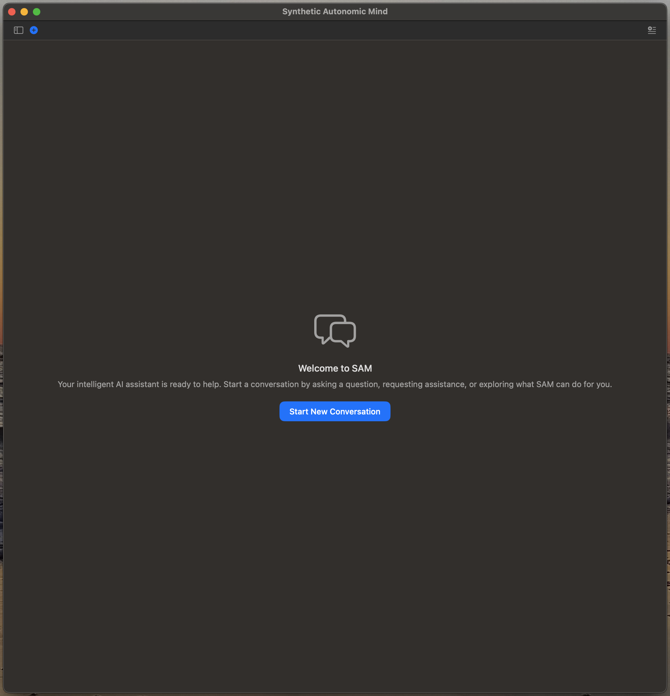

When you launch SAM, you'll see the main interface with three primary areas:

1. **Sidebar (Left)**: Your conversation list, search, and navigation
2. **Main Area (Center)**: Active conversation with toolbar and chat
3. **Bottom Bar**: Memory statistics, token count, and terminal access

### Conversation Sidebar

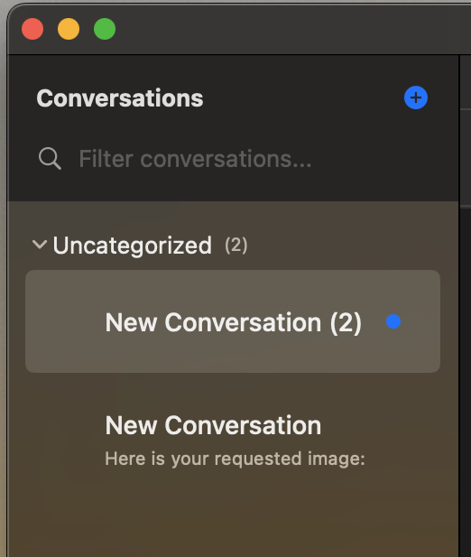

The sidebar provides access to all your conversations:

- **New Conversation Button**: Create new conversations with custom names
- **Conversation List**: All active conversations with timestamps
- **Pin Icon**: Pin important conversations to the top of the list
- **Search Field**: Find conversations by title or content
- **Global Search (F)**: Press F to search across all conversations for specific messages or content

### Model and Personality Selection

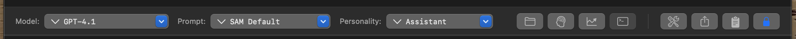

The model toolbar gives you control over which AI you're using and how it behaves. From left to right:

- **Model Selector**: Choose from cloud providers (OpenAI, Anthropic, GitHub Copilot, DeepSeek) or local models (MLX, GGUF)
- **System Prompt Selector**: Select predefined system prompts or create custom ones
- **Personality Selector**: Choose from built-in personalities (Assistant, Tinkerer, Wordsmith, etc.) or create your own
- **Working Directory Button**: Set or view the working folder for this conversation
- **Memory Panel Button**: Access memory search and management
- **Performance Metrics Button**: View token usage and performance statistics
- **Terminal Button**: Open the integrated terminal for command execution
- **Advanced Parameters Button**: Access temperature, top-p, repetition penalty, and other settings
- **Export Button**: Export conversation to JSON format
- **Todo List Button**: View and manage agent task lists
- **Scroll Lock**: Lock/unlock automatic scrolling in chat

### Conversation Header

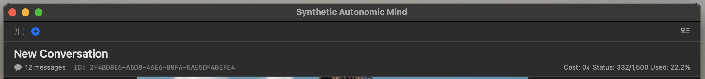

The conversation header displays conversation metadata and controls:

**Top Left:**
- **Conversation Title**: Click to rename your conversation

**Bottom Left:**
- **Message Count**: Number of messages in this conversation
- **Conversation ID**: Unique identifier for this conversation

**Top Right:**
- **Mini-Prompts Indicator**: Shows number of mini-prompts selected when panel is closed
- **Shared Topic Identifier**: Shows shared topic name when enabled, blank otherwise

**Bottom Right (GitHub Copilot specific):**
- **Cost Multiplier**: Token cost multiplier for current model
- **Status Used/Remaining**: Tokens or requests used vs remaining
- **Usage Percentage**: Percentage of quota consumed

### Chat Input Area

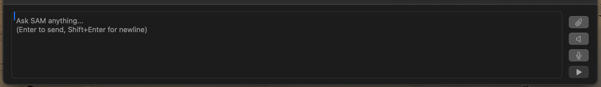

The input area at the bottom is where you interact with SAM:

- **Message Input Field**: Type your messages here (supports multi-line with Shift+Enter)
- **Paperclip Button**: Attach files (PDFs, text, code, images) which are automatically imported before sending
- **Send Button**: Send your message (or press Enter)

### Advanced Parameters

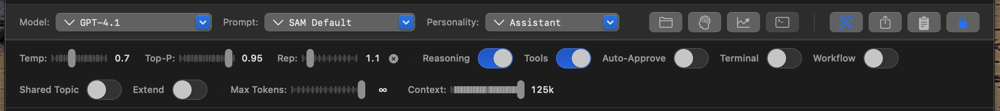

Click the parameters button to access fine-grained control over model behavior:

**Sliders:**
- **Temperature (Temp)**: Controls randomness (0.0 = focused and deterministic, 1.0 = creative and varied)
- **Top-P**: Nucleus sampling for response diversity
- **Repetition Penalty (Rep)**: Reduces repetition in responses
- **Max Tokens Slider**: Maximum length of SAM's response
- **Context Slider**: How much conversation history SAM can see

**Switches:**
- **Reasoning**: Enable chain-of-thought reasoning
- **Tools**: Enable/disable tool usage (file operations, web search, etc.)
- **Auto-Approve**: Automatically approve tool operations
- **Terminal**: Show/hide terminal panel
- **Workflow**: Enable workflow mode
- **Shared Topic**: Enable shared workspace across conversations
- **Extend**: Enable context extension

### Working Directory

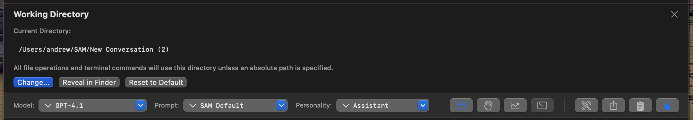

Each conversation has its own working directory where SAM reads and writes files:

- **Current Directory**: Shows current working directory path (default: ~/SAM/ConversationName/)
- **Change Directory**: Click to select a different folder
- **Reveal in Finder**: Open the working directory in Finder
- **Reset to Default**: Return to default conversation directory
- **Auto-Sync**: When you rename a conversation, the folder renames automatically

### Memory Toolbar

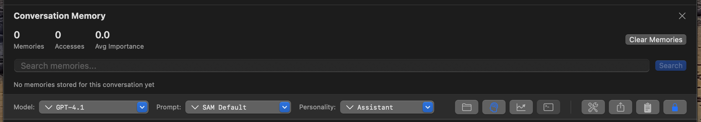

The memory toolbar shows and controls SAM's semantic memory:

- **Memory Count**: Number of memories stored for this conversation or topic
- **Search Memories**: Query stored memories semantically
- **Clear Memories**: Remove memories for conversation or shared topic

### Mini-Prompts

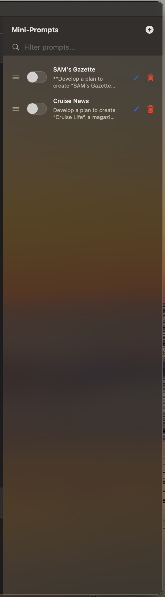

Mini-prompts inject consistent context into your conversations without repeating yourself. They're perfect for location-based queries, project details, or personal preferences.

**How to Use:**
1. Click the Mini-Prompts button in the conversation header
2. Toggle mini-prompts on/off for the current conversation
3. Create new mini-prompts in Preferences → Mini-Prompts
4. Context is automatically added to every message when enabled

**Example Mini-Prompts:**

**SAM's Gazette** - Automated local news aggregation:
```
Name: SAM's Gazette

Content:
**Develop a plan to create "SAM's Gazette", a newspaper serving {LOCATION}.**
- Your ONLY output must be the fully formatted newspaper (no summaries, bullet lists, or explanations before the complete newspaper).
- If you encounter issues fetching or scraping articles, ADAPT AND OVERCOME:  
    - Try alternative sources, deeper searches, local blogs, government or community pages, social media, or official press releases.
    - Use all available tools and methods to extract genuine, detailed news content for each section.
    - Do not stop or give up on a section due to initial errors—investigate, retry, and exhaust all reasonable options to gather information.
- If any section cannot be fully populated despite all possible efforts, you MUST:
    - Clearly state at the end which sections are incomplete and provide a specific explanation for each (e.g., site inaccessible, no current articles available).
    - Never omit or skip this explanation if there is missing content.

## REQUIRED OUTPUT FORMAT

    # SAM's Gazette - Daily Edition for {LOCATION}  
    **Date: {DATE}**

    ---

    ## Top Headlines
    - 3–6 most important stories from all sections.  
        ### **{TITLE}**  
        *[{SOURCE NAME}]({SOURCE LINK}) — {DATE}*  
        {Concise, factual summary with detail.}

    ## Local/{CITY} News 
    - At least 3 local news articles.

    ## {STATE} Statewide News
    - At least 3 statewide articles.

    ## Community Alerts
    - At least 3 public safety, health, or event articles.

    ## Weather Updates
    - At least 3 items: forecast, warnings, or notable events.

    ## Crime & Public Safety
    - At least 3 crime/public safety articles.

    ## Politics & Government 
    - At least 3 politics/government articles.

    ## Major Events (Technology, Business, Sports, etc.)
    - At least 3 major tech, business, or sports events.

    ---
    **Thank you for reading SAM's Gazette!**

---

## INSTRUCTIONS & RULES

- For every newspaper section, you MUST:
    1. Search for current, live news articles (not just headlines, timelines, or aggregators). If initial sources fail, use alternative sources and methods until you have content.
    2. Scrape or fetch the full article content from direct news links. If a site blocks scraping, try to fetch, use alternate sites, or seek official press releases.
    3. Extract and synthesize a detailed summary for each article based on its actual body (not just snippets or headlines).
    4. Format the entire newspaper strictly according to the provided markdown template, including icons, bold section headers, and HRULE (`---`) separators.
    5. Each article must include a unique, direct source link to the full story (never a homepage or generic timeline).
    6. If unable to fully populate a section after all reasonable attempts, explain exactly which sections are incomplete and why at the end of the newspaper (never omit this step).

- Never output summaries, bullet lists, or generic link lists in place of the formatted newspaper.
- Never rely on homepage, timeline, or snippet-only links for summaries—always extract full article content.
- Review every section for compliance before publishing.
- If all sections are complete, do NOT include any explanation at the end.
```

**Cruise News** - Specialized industry news aggregation:
```
Name: Cruise News

Content:
Develop a plan to create "Cruise Life", a magazine for cruise enthusiasts. The magazine must include today's top headlines related to Norwegian (NCL), Royal Caribbean (RCCI), and MSC Cruises. For each article provide a concise summary of each story with a direct link to the original source page so the reader can go directly to the source for more information. Use proper emojis for each section header.

Focus company press releases, significant events, and general industry news. Research and identify specific locations or details for unique stories. Provide the response in markdown in the style of a magazine with all of the relevant sections.
```

**Use Cases for Mini-Prompts:**
- **Location-Based**: Automatically include your location for weather, local search, or news
- **Project Context**: Include tech stack, coding preferences, or project constraints
- **Personal Preferences**: Name, role, communication style preferences
- **Specialized Workflows**: Repeated tasks like news aggregation, report generation, or research briefs

**Best Practices:**
- Keep mini-prompts focused on one type of context
- Use different mini-prompts for different conversation types
- Toggle off mini-prompts that aren't relevant to current conversation
- Update mini-prompts as your context changes

### Keyboard Shortcuts

**Essential:**
- **⌘N**: New conversation
- **⌘,**: Open Preferences
- **⌘W**: Close current window
- **⌘Q**: Quit SAM
- **⌘?**: Open Help
- **F**: Global search across all conversations

**Conversation:**
- **⌘T**: Toggle tools on/off
- **⌘Return**: Send message
- **⌘K**: Clear chat input
- **⌘L**: Focus message input
- **⌘[**: Previous conversation
- **⌘]**: Next conversation

**File Operations:**
- **⌘O**: Open file/conversation
- **⌘S**: Save conversation
- **⌘E**: Export conversation
- **⌘I**: Import document

**Tip**: For a complete list of keyboard shortcuts, press **⌘?** to open the in-app help.

---

## Example Conversations

Here are real examples showing how SAM handles different types of requests. These screenshots demonstrate SAM's web search, document processing, and image generation capabilities in action.

### Initial Web Search

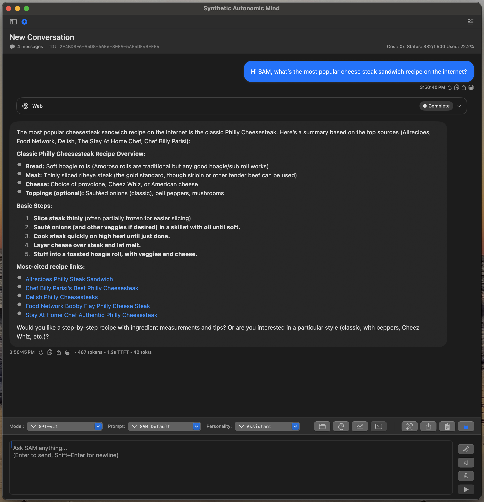

The user asks SAM to share the most popular cheesesteak recipe. SAM performs a web search, finds top recipes from multiple sources (Allrecipes, Food Network, Delish, Chef Billy Parisi), and provides a comprehensive summary with direct links to each recipe.

### Recipe Retrieval

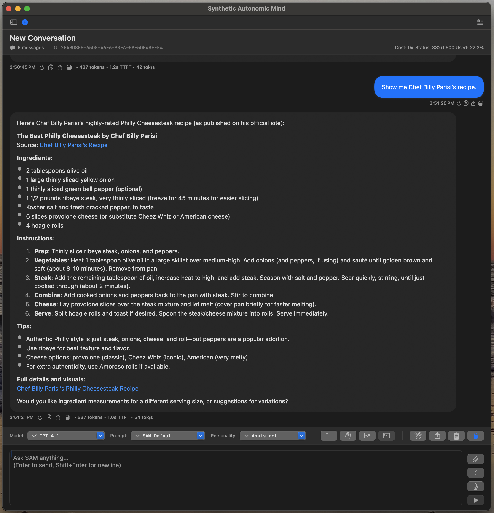

The user requests Chef Billy Parisi's recipe specifically. SAM retrieves the full recipe including ingredients, step-by-step instructions, tips, and a direct link to the source. No copy-pasting needed - SAM extracts and formats the complete recipe.

### Local Business Search

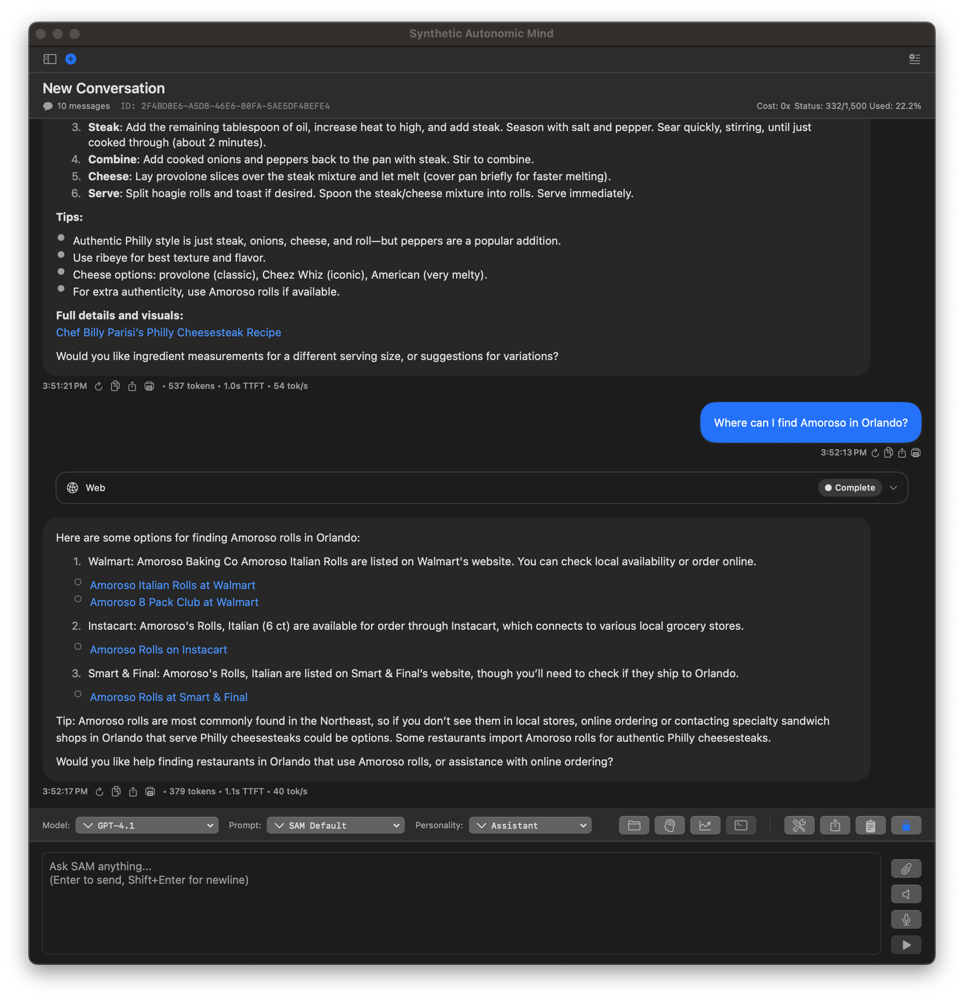

The user asks where to find Amoroso rolls in Orlando, FL. SAM performs location-aware searches and provides multiple shopping options (Walmart, Instacart, Smart & Final) with direct product links and local availability information.

### Image Generation

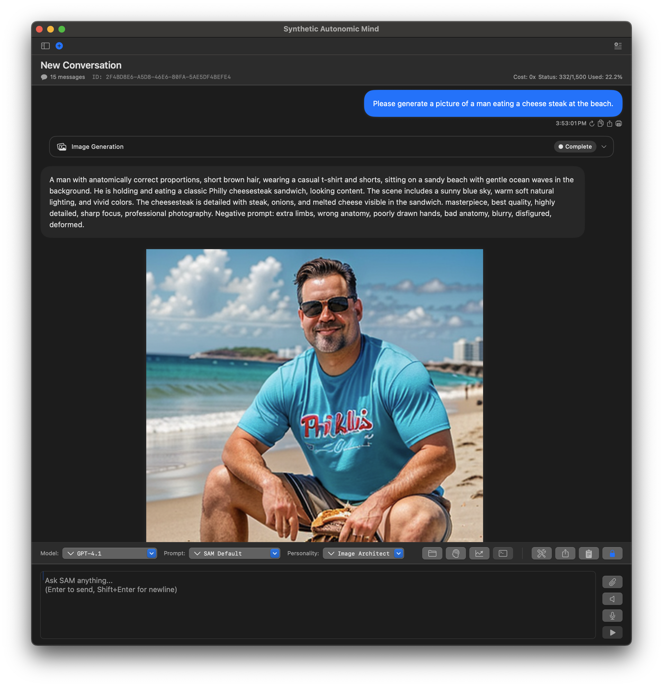

The user requests an image of a man eating a cheesesteak at the beach. SAM automatically crafts a detailed Stable Diffusion prompt, generates the image, displays it in the chat, and shows all generation parameters used (model, steps, guidance scale, etc.).

**What These Examples Show:**
- **Web Search Integration**: SAM searches DuckDuckGo and presents results with links
- **Content Extraction**: Fetches full articles and recipes, not just snippets
- **Location Awareness**: Uses mini-prompts (user location) for localized searches
- **Image Generation**: Creates detailed Stable Diffusion prompts and generates images
- **Natural Flow**: Conversation flows naturally between different task types
- **Tool Transparency**: Shows exactly which tools were used and their results

---

## Next Steps

Now that you have SAM running, explore its features:

### Learn SAM's Capabilities
- **[Features Overview](features-overview.md)** - Comprehensive guide to all features
- **[Memory & RAG](memory-and-rag.md)** - Understanding SAM's memory system
- **[Shared Topics](shared-topics.md)** - Multi-conversation collaboration

### For Power Users
- **[Configuration Guide](../power-user/configuration.md)** - All settings explained
- **[Tools Reference](../power-user/tools-reference.md)** - SAM's MCP tools
- **[Advanced Workflows](../power-user/advanced-workflows.md)** - Subagents, complex projects

### Try These Use Cases

**For Coding**:
```
Read my Python project in ~/my-project and help me add a new feature for user authentication
```

**For Research**:
```
Research the latest developments in quantum computing and create a summary document
```

**For Document Analysis**:
1. Drag a PDF file into the chat window
2. Ask: "Summarize this document and extract the key points"

**For Complex Projects**:
1. Create a shared topic in Preferences
2. Create multiple conversations (frontend, backend, testing)
3. Enable shared topic in each conversation
4. Watch them collaborate on the same project

### Get Help

**Having Issues?**
- Check [Troubleshooting Guide](../power-user/troubleshooting.md)
- Visit [GitHub Issues](https://github.com/SyntheticAutonomicMind/SAM/issues)

**Want to Learn More?**
- Read [Architecture](../developer/architecture.md) for technical details
- See [API Reference](../developer/api-reference.md) for programmatic access
- Check [Contributing Guide](../developer/contributing.md) to contribute

---

**You're all set!** Start exploring SAM's features and see how it can help your workflow.

**What's Next?** → [Features Overview](features-overview.md)
