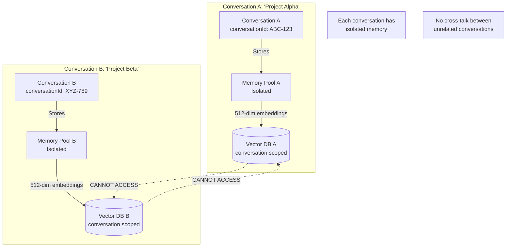
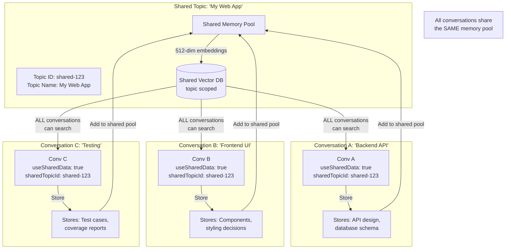

# Memory & RAG in SAM

**Your AI assistant with intelligent memory.**

"What did we decide about the database schema last Thursday?"  
"Find that authentication example from the security guide."  
"Remember we discussed pricing models? Let's revisit that."

SAM can store and recall important information within your conversations, and with **Shared Topics**, you can maintain persistent memory across multiple related conversations.

**This guide covers:**
- How memory works within conversations
- Using Shared Topics for persistent, cross-conversation memory
- Importing documents and searching them semantically
- Tips for building an effective knowledge base

---

## Table of Contents

1. [Overview](#overview)
2. [How Memory Works](#how-memory-works)
3. [Conversation vs Topic Memory](#conversation-vs-topic-memory)
4. [Using Memory Operations](#using-memory-operations)
5. [Document Import & RAG](#document-import--rag)
6. [Semantic Search](#semantic-search)
7. [Best Practices](#best-practices)
8. [Troubleshooting](#troubleshooting)

---

## Overview

SAM's memory system is one of its most useful features. Unlike simple chat history, SAM truly understands and remembers information using:

- **Vector RAG**: Semantic understanding using 512-dimensional vectors (Apple NaturalLanguage)
- **Conversation/Topic Scoping**: Isolated or shared memory between conversations
- **Persistent Storage**: SQLite database that survives restarts
- **Explicit Storage**: You control what gets remembered
- **Cross-Conversation Search**: Find information across all your conversations

**What Makes It Different**:
- Understands meaning, not just keywords
- Retrieves based on context, not exact word matches
- Scales to millions of memories
- Privacy-aware with scope isolation

---

## How Memory Works

### How Memory Storage Works

SAM stores information when you ask it to, or when SAM decides something is important:

**What Can Be Stored**:
- Code snippets and implementations
- Project requirements and specifications
- Decisions and reasoning
- File paths and locations
- API keys and configurations
- User preferences and settings

**Storage is Explicit - You Control It**:
- SAM doesn't automatically store everything you say
- Information gets stored when you explicitly ask ("Remember that...")
- Or when SAM uses memory operations to store important context
- This prevents clutter and ensures only relevant information is saved

### Manual Memory Storage

You can explicitly tell SAM to remember information:

```
You: Remember that I prefer Python over JavaScript for backend work
SAM: I'll remember your preference for Python over JavaScript for backend development.
```

Later:
```
You: What language should I use for this API?
SAM: Based on your preference, I recommend Python for backend API development.
```

### Vector Embeddings

**How It Works** (simplified):
1. Your content is converted to a 512-dimensional vector (numerical representation)
2. These vectors capture the meaning of the content
3. Similar meanings produce similar vectors
4. Searching compares vectors to find related content

**Benefits**:
- "authentication code" finds JWT, OAuth, password hashing, and more
- "error handling" finds try-catch, exceptions, error classes
- "database queries" finds SQL, ORM, query builders

---

## Conversation vs Topic Memory

### Conversation-Scoped Memory (Default)

**When to Use**:
- Unrelated projects
- Privacy-sensitive work
- Personal conversations
- Temporary work

**How It Works**:



**Example - Why Isolation Matters**:
```
Conversation A: "Project Alpha"
You: Remember I'm using React for the frontend

Conversation B: "Project Beta" (different conversation)
You: What frontend framework am I using?
SAM: I don't have information about your frontend framework in this conversation.
```

This isolation is intentional - keeps your projects separate and private.

### Topic-Scoped Memory (Shared Topics)

**When to Use**:
- Multiple conversations on same project
- Team-like collaboration with specialized conversations
- Complex projects with different aspects

**How It Works**:



**Example - Sharing Knowledge Across Conversations**:
```
Shared Topic: "My Web App" (enabled in both conversations)

Conversation 1: "Backend API"
You: Remember we're using PostgreSQL with SQLAlchemy ORM

Conversation 2: "Frontend UI" (different conversation, same topic)
You: What database and ORM are we using?
SAM: We're using PostgreSQL with SQLAlchemy ORM.
     [Retrieved from shared topic memory!]
```

---

## Using Memory Operations

### Store Memory

Explicitly store information for future retrieval:

**Basic Storage**:
```
You: Store this in memory: Project API endpoint is https://api.myapp.com
SAM: Stored in memory with importance 0.8
```

**With Tags** (via tool):
```json
{
  "operation": "store_memory",
  "content": "Production database: db-prod-01.mycompany.com:5432",
  "tags": ["database", "production", "critical"]
}
```

**Importance Levels** (optional, advanced):
- **0.0-0.3**: Low importance (temporary notes, ideas)
- **0.4-0.6**: Medium importance (project details, preferences)
- **0.7-0.9**: High importance (critical information, decisions)
- **0.9-1.0**: Critical (passwords, keys, essential config)

### Search Memory

Search your stored memories:

**Natural Language**:
```
You: Search memory for anything about database configuration
SAM: Found 3 memories about database configuration:
1. PostgreSQL connection string (importance: 0.9)
2. Database migration notes (importance: 0.6)
3. Performance tuning settings (importance: 0.7)
```

**Adjusting Similarity Threshold**:
- **0.3-0.5** (Default): Balanced - good for most searches
- **0.2-0.3**: More results (broader search)
- **0.15-0.2**: Very broad (use for document searches)

**Example** (via tool):
```json
{
  "operation": "search_memory",
  "query": "authentication implementation",
  "similarity_threshold": "0.3",
  "limit": 10
}
```

### Memory Statistics

Check how much is stored:

```
You: Show memory stats
SAM: Memory Statistics:
- Total memories: 247
- Conversation-scoped: 185
- Topic-scoped: 62
- Database size: 15.2 MB
- Last updated: 2 minutes ago
```

### Clear Memories

Remove stored memories (use with caution!):

**Conversation Scope**:
```
You: Clear all memories for this conversation
SAM: ⚠️ This will delete all memories for this conversation. Confirm?
```

**Topic Scope**:
```
You: Clear memories for this shared topic
SAM: ⚠️ WARNING: This will delete memories for ALL conversations in this topic!
```

---

## Document Import & RAG

### How Vector RAG Works

```mermaid
graph LR
    subgraph "Document Import Pipeline"
        Doc[PDF/DOCX/Text<br/>Document]
        Extract[Content Extraction<br/>Text parsing]
        Chunk[Page-Aware Chunking<br/>Semantic Boundaries]
        Embed[Embedding Generation<br/>Vector representation]
        Store[(Vector Database<br/>conversationId tagged)]
    end
    
    subgraph "Query Processing"
        Query[User Query<br/>"Find auth examples"]
        QueryEmbed[Query Embedding<br/>512-dim vector]
        Search[Cosine Similarity<br/>Search]
        Results[Top K Chunks<br/>threshold ≥ 0.15]
        Context[Add to LLM<br/>Context]
        Response[AI Response<br/>with citations]
    end
    
    Doc -->|Read| Extract
    Extract -->|Split| Chunk
    Chunk -->|Generate| Embed
    Embed -->|Persist| Store
    
    Query -->|Embed| QueryEmbed
    QueryEmbed -->|Search| Search
    Store -->|Match| Search
    Search -->|Retrieve| Results
    Results -->|Inject| Context
    Context -->|Generate| Response
    
    Note1[Chunks preserve<br/>page numbers]
    Note2[Similarity threshold:<br/>0.15-0.25 for docs]
```

### Importing Documents

**Drag & Drop**:
1. Drag PDF, Word doc, or text file into chat
2. SAM automatically imports and processes
3. Document chunks stored in vector database

**Supported Formats**:
- PDF (text extraction)
- Word documents (.docx)
- Text files (.txt, .md, .rtf)

**Searchable Metadata** (New):
SAM now stores searchable metadata with each document chunk, including:
- **Filename**: The original document name
- **File path**: Where the document was located
- **Page numbers**: For PDF documents
- **Chunk boundaries**: Paragraph or page-based

This means you can ask questions like:
- "What files mention authentication?"
- "Which document discusses database configuration?"
- "Show me all PDFs about machine learning"

The metadata is searchable alongside document content, making it easier to find and reference specific documents in your knowledge base.
- Code files (all languages)

**What Happens During Import**:
1. **Read**: Content extracted from your file
2. **Chunk**: Split into manageable pieces (preserving page numbers)
3. **Embed**: Each chunk converted to a 512-dimensional vector
4. **Store**: Chunks saved in memory with metadata
5. **Tag**: Labeled as "document" for easy filtering

**Example**:
```
You: [Drags "Research_Paper.pdf" into chat]

SAM: Importing "Research_Paper.pdf"...
- Pages: 35
- Chunks created: 87
- Format: PDF
- Size: 2.4 MB

Document successfully imported and indexed for semantic search.
```

### Querying Imported Documents

**Simple Questions**:
```
You: What does the research paper say about methodology?

SAM: The research paper describes the methodology on pages 12-15:
[Retrieves and summarizes relevant chunks]
```

**Cross-Document Queries**:
```
You: Compare the authentication approaches in backend_api.pdf and security_guide.md

SAM: Comparing authentication approaches:

backend_api.pdf (pages 8-10):
- JWT tokens with 24-hour expiration
- Refresh tokens for extended sessions

security_guide.md:
- OAuth2 with provider integration
- API keys for service-to-service
```

### Page-Aware Retrieval

SAM preserves page information when chunking:

```
You: Find all mentions of "machine learning" in the document

SAM: Found "machine learning" mentioned in:
- Page 3: Introduction and overview
- Page 15: ML model architecture
- Page 28: Performance evaluation
- Page 42: Future ML applications
```

---

## Semantic Search

### How It Works

**Traditional Keyword Search**:
```
Query: "error handling"
Finds: Only exact phrase "error handling"
```

**SAM's Semantic Search**:
```
Query: "error handling"
Finds: 
- "try/catch blocks"
- "exception management"
- "error recovery strategies"
- "failure handling patterns"
- And more related concepts
```

### Similarity Thresholds Explained

**How Similarity Works**:
- Cosine similarity between query and stored content vectors
- Range: 0.0 (completely different) to 1.0 (identical)
- Threshold filters out low-similarity results

**Recommended Thresholds**:

| Use Case | Threshold | Explanation |
|----------|-----------|-------------|
| Document/RAG Search | 0.15-0.25 | Embeddings produce lower scores |
| Conversation Memory | 0.3-0.5 | Higher scores for direct statements |
| Precise Matching | 0.5+ | Only very similar content |

**When You Get No Results**:
Lower the threshold step by step:
```
Start: 0.3 → Try: 0.25 → Try: 0.2 → Last resort: 0.15
```

### Search Tips

**Be Specific**:
```
❌ "code"
✅ "authentication code using JWT tokens"
```

**Use Context**:
```
❌ "that thing"
✅ "the database migration script for PostgreSQL"
```

**Combine Keywords**:
```
✅ "React component for user profile display with hooks"
```

---

## Best Practices

### Memory Management

**Do**:
✅ Store important decisions and requirements
✅ Tag memories for easy organization
✅ Use appropriate importance levels
✅ Regularly search to verify what's stored
✅ Use shared topics for multi-conversation projects

**Don't**:
❌ Store temporary or trivial information
❌ Duplicate information unnecessarily
❌ Clear memories without backing up critical info
❌ Mix unrelated projects in same topic scope

### Document Import

**Do**:
✅ Import reference documents early
✅ Organize documents by project/topic
✅ Use descriptive filenames
✅ Import code for semantic search
✅ Keep documents updated

**Don't**:
❌ Import duplicate versions
❌ Import irrelevant documents
❌ Forget which conversation has which docs
❌ Mix personal and project documents without organization

### Search Strategies

**Progressive Search**:
1. Start with higher threshold (0.4)
2. If no results, lower to 0.3
3. Still nothing? Lower to 0.2
4. For documents, try 0.15

**Refine Queries**:
1. Start broad: "authentication"
2. Refine: "JWT authentication implementation"
3. Very specific: "JWT token validation middleware in Express"

---

## Troubleshooting

### No Memory Results

**Problem**: Search returns no results

**Solutions**:
1. **Lower threshold**: Try 0.2 instead of 0.3
2. **Broader query**: "auth" instead of "JWT authentication"
3. **Check scope**: Are you in right conversation/topic?
4. **Verify storage**: Check memory stats to confirm data exists

### Document Not Searchable

**Problem**: Imported document but can't find content

**Solutions**:
1. **Verify import**: Check if import completed successfully
2. **Right scope**: Using same conversation/topic as import?
3. **Wait for indexing**: Large documents may take a moment
4. **Check format**: Some PDFs may have extraction issues

### Memory Growing Too Large

**Problem**: Memory database is very large

**Solutions**:
1. **Clear old conversations**: Remove memories from finished projects
2. **Use topic scope**: Share memory across related conversations
3. **Importance filtering**: Clear low-importance memories
4. **Selective clearing**: Remove specific memories, not all

### Wrong Memories Retrieved

**Problem**: Search returns irrelevant results

**Solutions**:
1. **Raise threshold**: Use 0.4-0.5 for more precise results
2. **More specific query**: Add context and details
3. **Check stored content**: Search may be working correctly but content is wrong
4. **Clear duplicates**: Remove redundant or incorrect memories

---

## Example Workflows

### Research Project

```
1. Create shared topic "AI Research"
2. Create conversations: "Literature Review", "Experiments", "Writing"
3. Import research papers in "Literature Review"
4. All conversations can search papers
5. Store findings in shared memory
6. Cross-reference across conversations
```

### Software Development

```
1. Create shared topic "My App"
2. Import documentation, requirements in one conversation
3. Store architecture decisions
4. All development conversations access same memory
5. Search for "how we decided to handle X"
6. Consistent information across conversations
```

### Personal Knowledge Base

```
1. Use separate conversations for different topics
2. Import personal notes, articles, books
3. Store important insights
4. Search across all conversations for information
5. Build personal knowledge graph over time
```

---

## Next Steps

**Learn More**:
- **[Shared Topics Guide](shared-topics.md)** - Multi-conversation workflows
- **[Tools Reference](../power-user/tools-reference.md)** - Memory operations in detail
- **[Advanced Workflows](../power-user/advanced-workflows.md)** - Complex memory usage

**Related Topics**:
- **[Features Overview](features-overview.md)** - All SAM features
- **[Configuration](../power-user/configuration.md)** - Memory settings

---

**Master SAM's memory system and unlock its full potential!**
