# Real-World Use Cases

**See how SAM solves real problems for real people.**

This guide shows practical scenarios where SAM helps. Each example includes step-by-step setup and what to expect. Find the scenario closest to your needs and follow along.

---

## Table of Contents

1. [Getting Started Quickly](#getting-started-quickly)
2. [Understanding SAM's Five Layers](#understanding-sams-five-layers)
3. [Document Analysis](#document-analysis)
   - [Medical Records](#medical-records)
   - [Legal Documents](#legal-documents)
   - [Financial Statements](#financial-statements)
4. [Developer Workflows](#developer-workflows)
   - [Code Project Assistant](#code-project-assistant)
   - [Multi-Team Project](#multi-team-project)
5. [Research & Writing](#research--writing)
   - [Academic Research](#academic-research)
   - [Content Creation](#content-creation)
6. [Diagram Generation](#diagram-generation)
7. [Business Analysis](#business-analysis)
   - [Customer Analysis](#customer-analysis)
   - [Competitive Research](#competitive-research)
8. [Choosing the Right Model](#choosing-the-right-model)

---

## Getting Started Quickly

**Most users should start here.** Connect a cloud provider and start chatting. You can always switch to local models later.

### The Fastest Path

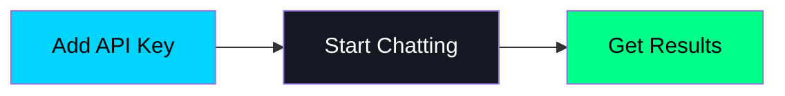

1. Go to **Preferences → Remote Providers**
2. Add your OpenAI, Anthropic, or GitHub Copilot credentials
3. Create a new conversation
4. Enable **Tools** toggle
5. Start asking questions

**That's it.** SAM handles the rest.

### Which Provider Should I Use?

| If you want... | Use this |
|----------------|----------|
| Best overall quality | GPT-4 or Claude 3.5 |
| Already have Copilot | GitHub Copilot (free if subscribed) |
| Budget-conscious | GPT-4 Turbo or DeepSeek |
| Complete privacy | Local MLX model |

### About Privacy

**Cloud models** send your messages to the provider's servers. This is fine for most tasks.

**Local models** process everything on your Mac. Use these for sensitive data like medical records, legal documents, or personal journals.

**You can mix both:** Start with a cloud model for general work, switch to local when handling private information.

---

## Understanding SAM's Five Layers

Before diving into use cases, understand how SAM builds your AI experience. SAM uses five layers, each adding more customization.

### Layer 1: System Prompt

The system prompt defines SAM's core behavior. Think of it as SAM's job description.

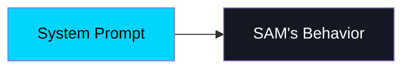

**Two built-in options:**

| Prompt | Best For |
|--------|----------|
| SAM Default | General use, most users |
| SAM Minimal | Local models, speed |

**How to change:** Click the system prompt picker in the conversation toolbar.

---

### Layer 2: Personality

Personality changes HOW SAM communicates. Same capabilities, different style.

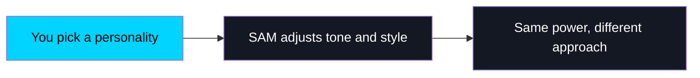

**Example personalities:**

| Category | Personality | Style |
|----------|-------------|-------|
| General | Assistant | Balanced, helpful |
| Tech | Tinkerer | Hands-on, practical |
| Creative | Wordsmith | Encouraging writer |
| Domain | Doctor | Clinical methodology |
| Fun | Pirate | Arr, nautical flair! |

**How to change:** Click the personality picker next to the model selector.

---

### Layer 3: Mini-Prompts

Mini-prompts are reusable context snippets. Create once, enable when needed.

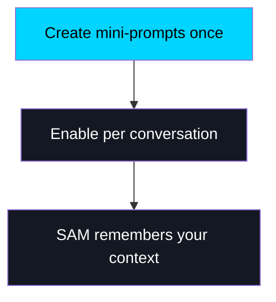

**Example mini-prompts:**

- "I live in Portland, Oregon. Pacific timezone."
- "My system: MacBook Pro M3 Max, 64GB RAM"
- "Current project: React + TypeScript + Tailwind"
- "Code style: 4-space indent, functional components"

**How to create:** Go to **Preferences → Mini-Prompts → Add New**

---

### Layer 4: Tools

Tools define what SAM can DO. Enable or disable per conversation.

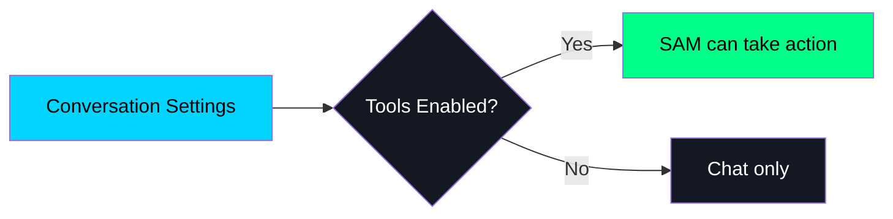

**Tool categories:**

- File operations (read, write, search)
- Terminal commands
- Web research
- Memory storage
- Image generation

**How to configure:** Click the **Tools toggle** in the conversation toolbar.

---

### Layer 5: Conversation History

Everything discussed in the current conversation becomes context.

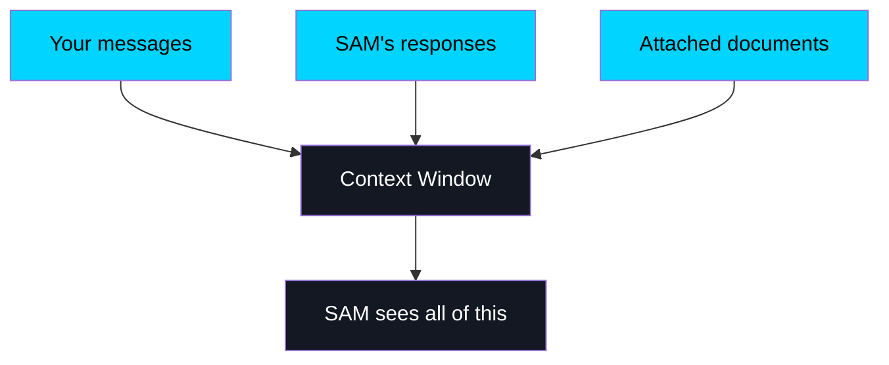

**Context window sizes by model:**

| Model | Context Size |
|-------|-------------|
| GPT-4 Turbo | Large |
| Claude 3.5 | Large |
| Gemini 1.5 | Very Large |
| Local MLX | Variable |

---

### How the Layers Work Together

Each layer builds on the previous one:

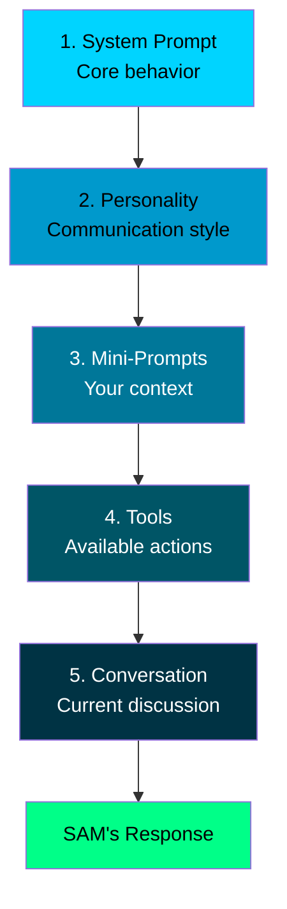

**Key insight:** You control each layer independently. Mix and match to create your ideal AI assistant.

---

## Document Analysis

SAM excels at reading and understanding your documents. Import PDFs, Word docs, or text files and ask questions about them.

### Medical Records

**The situation:** You have lab results and medical records. You want to understand trends before your next appointment.

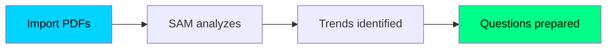

**Setup options:**

| Your preference | Configuration |
|-----------------|---------------|
| **Quick start** | Any cloud model + Doctor personality |
| **Privacy-first** | Local MLX model + Doctor personality |

**Step 1: Configure**

1. Select your model (cloud or local)
2. Select **Doctor** personality
3. Enable **Tools** toggle

**Step 2: Import your documents**

Drag your PDF lab results into the chat window.

**Step 3: Ask questions**

```
You: I have lab results from 2020-2024. Help me understand 
my cholesterol trends before my cardiology appointment.

SAM: I've analyzed your lipid panels. Here's what I found:

TRENDS:
- LDL: Started at 142, now at 118 (improved)
- HDL: Stable around 52-55 (borderline low)
- Triglycerides: Spike in 2022 (285), now 168

QUESTIONS FOR YOUR CARDIOLOGIST:
1. LDL improved after starting medication in 2022. 
   Should we continue current dose?
2. HDL has been consistently in the 50s. What lifestyle 
   changes could help raise it?

DISCLAIMER: This is for informational purposes. 
Always discuss with your doctor.
```

**What you get:**
- Analysis of trends over time
- Prepared questions for your doctor

**Privacy tip:** Use a local model if you prefer medical data stays on your Mac.

---

### Legal Documents

**The situation:** You're reviewing an employment contract. You need to understand complex terms before signing.

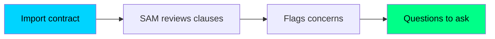

**Setup options:**

| Your preference | Configuration |
|-----------------|---------------|
| **Quick start** | Any cloud model + Counsel personality |
| **Privacy-first** | Local MLX model + Counsel personality |

**Step 1: Configure**

1. Select your model
2. Select **Counsel** personality
3. Enable **Tools** toggle

**Step 2: Import the contract**

Drag the PDF into chat.

**Step 3: Ask for analysis**

```
You: Review this employment contract. Explain the 
non-compete clause and flag anything unusual.

SAM: I've analyzed your employment agreement.

NON-COMPETE ANALYSIS (Section 8.2):
- Duration: 18 months post-employment
- Geographic scope: "Anywhere employer does business"
- Industry restriction: "Competing technology companies"

POTENTIAL CONCERNS:
1. California generally does NOT enforce non-competes.
   This clause may be unenforceable.
2. The geographic scope is extremely broad and 
   typically disfavored by courts.
3. 18 months is on the longer end of typical durations.

QUESTIONS TO ASK:
- Will they modify the non-compete given CA law?
- Can the scope be narrowed to direct competitors only?

DISCLAIMER: This is educational analysis, not legal advice.
```

**Privacy tip:** Use a local model for confidential contracts.

---

### Financial Statements

**The situation:** You need to organize investment statements and transactions for your tax accountant.

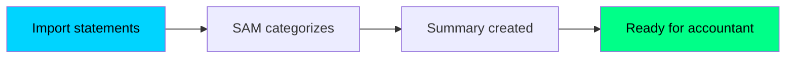

**Setup options:**

| Your preference | Configuration |
|-----------------|---------------|
| **Quick start** | Any cloud model + Finance Coach personality |
| **Privacy-first** | Local MLX model + Finance Coach personality |

**Step 1: Configure**

1. Select your model
2. Select **Finance Coach** personality
3. Enable **Tools** toggle

**Step 2: Import your statements**

Drag brokerage PDFs and transaction exports into chat.

**Step 3: Request organization**

```
You: I have statements from Fidelity and Schwab, plus 
crypto from Coinbase. Help me organize for my accountant.

SAM: I've analyzed your statements.

SUMMARY FOR YOUR ACCOUNTANT:

INVESTMENT INCOME:
- Dividends (qualified): $3,247
- Dividends (ordinary): $892
- Interest: $156

CAPITAL GAINS/LOSSES:
- Short-term gains: $4,521
- Long-term gains: $12,847
- Short-term losses: $2,103

CRYPTO (Needs Attention):
- 47 taxable events identified
- Net gain: ~$8,200 (needs Form 8949)
- 3 transactions may qualify as wash sales

I've created a summary document. Would you like me 
to organize by account or transaction type?
```

**Privacy tip:** Use a local model for sensitive financial data.

---

## Developer Workflows

### Code Project Assistant

**The situation:** You're working on a React/TypeScript project and want SAM to understand your codebase.

**Step 1: Configure your environment**

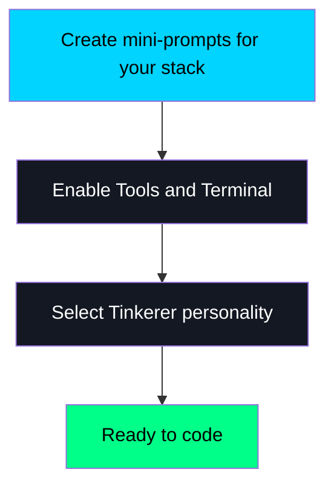

1. Create mini-prompts:
   - "Project: React 18 + TypeScript 5.3 + Vite + Tailwind"
   - "Code style: Functional components, named exports, strict TypeScript"
   - "Working directory: ~/projects/my-app/"

2. Select **Tinkerer** or **Crusty Coder** personality
3. Enable **Tools** and **Terminal** toggles
4. Enable the relevant mini-prompts for this conversation

**Step 2: Start coding**

```
You: Add a dark mode toggle to the header component

SAM: [Reads your existing Header.tsx]
[Checks your Tailwind config]
[Creates useTheme hook following your patterns]
[Updates Header.tsx with toggle button]
[Adds dark: variants to affected components]

Done. Here's what I did:
1. Created src/hooks/useTheme.ts with localStorage persistence
2. Updated Header.tsx with a toggle button (matches your UI patterns)
3. Added dark: variants to components

Run 'npm run dev' to test.
```

---

### Multi-Team Project

**The situation:** You're building a complex app that needs frontend, backend, and testing expertise.

**Step 1: Create a Shared Topic**

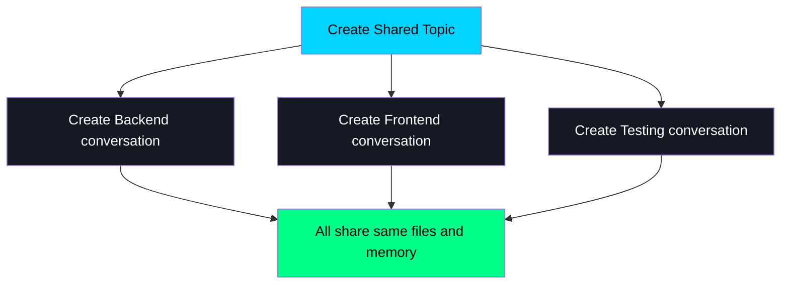

1. Go to **Preferences → Shared Topics**
2. Create topic: "My Web App"
3. Create three conversations:
   - "Backend API"
   - "Frontend UI"
   - "Testing"
4. Enable shared topic in each conversation

**Step 2: Work across conversations**

**In Backend conversation:**
```
You: Create a Flask API with user authentication
SAM: Created backend/app.py, backend/auth.py, backend/models.py
```

**In Frontend conversation:**
```
You: Read the backend API and create React components
SAM: [Reads backend/app.py from shared workspace]
Found endpoints: /login, /register, /products
Creating React components...
```

**In Testing conversation:**
```
You: Write integration tests for the API
SAM: [Accesses both backend and frontend code]
Creating tests in tests/
```

**What you get:**
- Each conversation specialized in its domain
- All see the same files
- Shared memory of architecture decisions

---

## Research & Writing

### Academic Research

**The situation:** You're writing a thesis with hundreds of sources to organize and synthesize.

**Step 1: Configure for research**

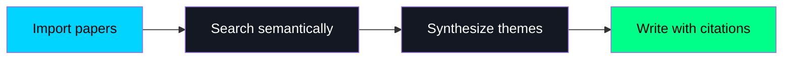

1. Use **Claude 3.5** (excellent for long documents)
2. Select **Scientist** personality
3. Create mini-prompts for your research topic and citation style

**Step 2: Import and analyze**

```
You: I have 47 papers on machine learning in healthcare. 
Help me identify main themes and gaps.

SAM: I've analyzed all 47 papers.

MAJOR THEMES:

Theme 1: Diagnostic Imaging (18 papers)
- Primary focus: radiology, pathology
- Key finding: CNN architectures dominate
- Gap: Few studies on deployment in resource-limited settings

Theme 2: Clinical Decision Support (14 papers)
- Primary focus: risk prediction, treatment selection
- Key finding: Explainability is major concern
- Gap: Longitudinal validation studies rare

Theme 3: NLP for Clinical Notes (11 papers)
- Primary focus: EHR analysis
- Key finding: Privacy-preserving methods emerging
- Gap: Limited non-English language research

RESEARCH GAPS (Potential thesis directions):
1. Intersection of explainability AND deployment
2. Cross-institutional validation studies
3. Patient-facing applications (only 3 papers!)
```

---

### Content Creation

**The situation:** You need to research a topic and create content from multiple sources.

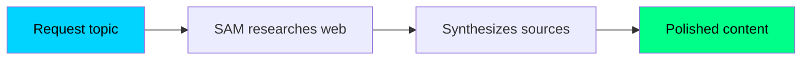

**Step 1: Configure for content**

1. Use any cloud model (GPT-4, Claude)
2. Select **Wordsmith** personality
3. Enable **Tools** toggle

**Step 2: Research and write**

```
You: Research AI developments this week and create a 
newsletter summary

SAM: [Searches multiple sources]
[Scrapes relevant articles]
[Synthesizes information]

AI WEEKLY DIGEST

HEADLINE: Major breakthrough in reasoning models...

[Continues with well-structured content]
```

---

## Diagram Generation

SAM renders mermaid diagrams inline. Just describe what you want and SAM creates a visual diagram.

### Supported Diagram Types

SAM supports 13 mermaid diagram types:

| Type | Best For |
|------|----------|
| **flowchart** | Process flows, decision trees |
| **sequenceDiagram** | API calls, user interactions |
| **classDiagram** | Object-oriented design |
| **stateDiagram** | State machines, workflows |
| **erDiagram** | Database schemas |
| **gantt** | Project timelines |
| **pie** | Data distribution |
| **journey** | User journey mapping |
| **mindmap** | Brainstorming, idea organization |
| **timeline** | Historical events, roadmaps |
| **quadrantChart** | Priority matrices |
| **requirementDiagram** | Requirements traceability |
| **gitGraph** | Branch and merge visualization |

### How to Create Diagrams

**Step 1:** Just ask SAM to create a diagram:

```
You: Create a flowchart showing user login flow

SAM: Here's the login flow:

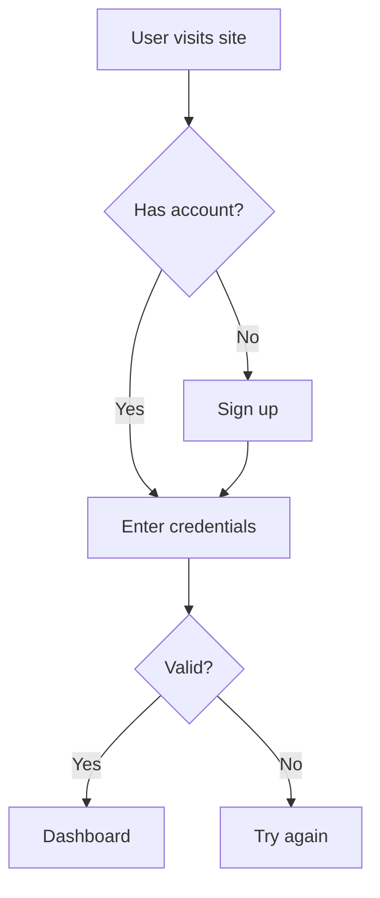

```

**Step 2:** SAM renders the diagram inline. You'll see a visual flowchart, not code.

**Step 3:** Ask for modifications:

```
You: Add 2FA step after valid credentials

SAM: Updated:
[Diagram with 2FA step added]
```

### Example Requests

**Architecture diagram:**
```
"Create a sequence diagram showing how the API handles authentication"
```

**Database schema:**
```
"Draw an ER diagram for a blog with users, posts, and comments"
```

**Project timeline:**
```
"Create a Gantt chart for our 3-month MVP development"
```

**Process visualization:**
```
"Make a state diagram for order processing: created, paid, shipped, delivered"
```

### Tips for Better Diagrams

1. **Be specific**: "flowchart with 5 steps" is better than "make a diagram"
2. **Name your elements**: "boxes for Frontend, Backend, Database" gives clearer results
3. **Iterate**: Ask SAM to add, remove, or restyle elements
4. **Request different types**: Try "show this as a sequence diagram instead"

---

## Business Analysis

### Customer Analysis

**The situation:** You have customer data and need insights for retention strategy.

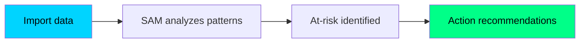

**Setup options:**

| Your preference | Configuration |
|-----------------|---------------|
| **Quick start** | Any cloud model + Professional personality |
| **Privacy-first** | Local MLX model + Professional personality |

**Step 1: Configure**

1. Select your model
2. Select **Professional** personality
3. Enable **Tools** toggle

**Step 2: Analyze your data**

```
You: Analyze my customer purchase history and identify 
who I should focus retention efforts on.

SAM: Based on your customer database:

HIGH-VALUE AT-RISK CUSTOMERS (Priority Outreach):

| Customer    | Lifetime Value | Last Purchase | Risk Level |
|-------------|---------------|---------------|------------|
| Acme Corp   | $24,500       | 89 days ago   | HIGH       |
| Beta LLC    | $18,200       | 67 days ago   | MEDIUM     |
| Delta Inc   | $15,800       | 112 days ago  | CRITICAL   |

RECOMMENDED ACTIONS:
1. Delta Inc: Immediate outreach. They haven't ordered in 
   112 days but historically order every 45 days.
2. Acme Corp: Schedule check-in. Order frequency dropped 
   from monthly to quarterly in Q3.

Would you like me to draft outreach emails?
```

**Privacy tip:** Use a local model for confidential customer data.

---

### Competitive Research

**The situation:** You need to gather intelligence on competitors.

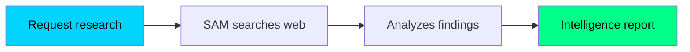

**Step 1: Configure**

1. Use any cloud model (best results with web access)
2. Select **Professional** personality
3. Enable **Tools** toggle

**Step 2: Research and organize**

```
You: Research our top 3 competitors' recent product announcements

SAM: [Searches company websites, news, press releases]

COMPETITIVE INTELLIGENCE REPORT:

COMPETITOR A:
- Announced: New enterprise tier (March 2025)
- Pricing: $99/seat vs our $79/seat
- Key feature: Advanced analytics dashboard

COMPETITOR B:
- Announced: Mobile app launch (Q2 2025)
- Strategy: Focus on small business market
- Weakness: No API access in base tier

COMPETITOR C:
- No major announcements
- Note: Recent layoffs suggest budget constraints

STRATEGIC IMPLICATIONS:
1. Our pricing remains competitive
2. Mobile app should be prioritized
3. Opportunity to capture Competitor C's customers
```

---

## Choosing the Right Model

Different models excel at different tasks:

### Quick Reference

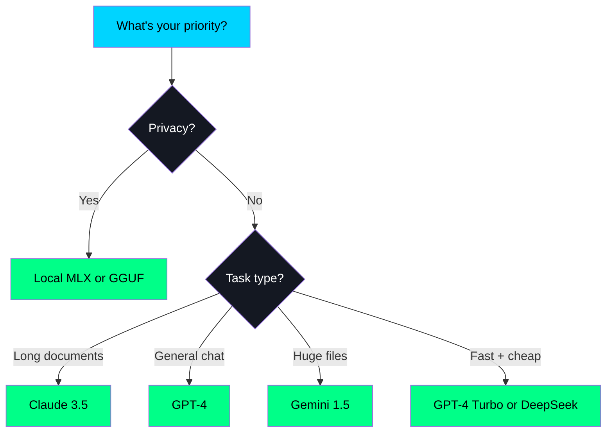

### Model Comparison

| Model | Speed | Context | Privacy | Cost |
|-------|-------|---------|---------|------|
| GPT-4 | Medium | Large | Cloud | $$ |
| Claude 3.5 | Medium | Large | Cloud | $$ |
| Gemini 1.5 | Medium | Very Large | Cloud | $$ |
| Local MLX | Varies | Variable | 100% Local | FREE |
| Local GGUF | Varies | Variable | 100% Local | FREE |

### Model Switching

You can switch models mid-conversation. SAM maintains context across switches.

```
Start: Local model for sensitive discussion
Switch: Cloud model for complex reasoning
Return: Local model for final sensitive summary
```

**How to switch:** Click the model picker and select a different model.

---

## Next Steps

**Pick a scenario and try it:**

1. Choose the use case closest to your needs
2. Follow the setup steps
3. Start with a simple request
4. Build from there

**Learn more:**

- [Memory & RAG](memory-and-rag.md) - Understanding SAM's memory system
- [Shared Topics](shared-topics.md) - Multi-conversation collaboration
- [Tools Reference](../power-user/tools-reference.md) - Complete tools reference
- [Configuration](../power-user/configuration.md) - Complete settings guide

---

**Ready to get started?** Open SAM and try one of these scenarios today.
